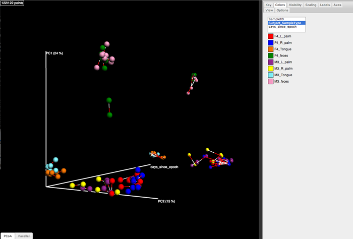

.. _procrustes_analysis:

==============================
Performing Procrustes Analysis
==============================

This tutorial covers how to perform Procrustes Analysis using QIIME to compare UniFrac PCoA plots generated by two different processing pipelines. Procrustes analysis takes as input two coordinate matrices with corresponding points (in QIIME, these are generated by running ``principal_coordinates.py`` on a distance matrix generated by ``beta_diversity.py``), and transforming the second coordinate set by rotating, scaling, and translating it to minimize the distances between corresponding points in the two shapes. This is done with ``transform_coordinate_matrices.py``. The results can then be visualized using QIIME by running ``compare_3d_plots.py``. Both sets of coordinates will be plotted in the resulting figure, with bars connecting the corresponding points from each data set.

For example, Figure 1 is a plot that was generated by comparing two different sets of reads, one set generated on 454 and the other generated on Illumina, from the same collection of samples. In this scenario, Procrustes analysis allows us to determine whether we would derive the same beta diversity conclusions, regardless of which technology was used to sequence the amplicons. This tutorial illustrates the steps used to generate this plot, beginning with closed reference OTU picking on both the 454 and the Illumina data. The data sets used in this tutorial are a subset of the data that was used in Supplementary Figure 1 of `Moving Pictures of the Human Microbiome <http://www.ncbi.nlm.nih.gov/pubmed/21624126>`_. 

   
   Figure 1: Procrustes comparison of unweighted UniFrac PCoA plots derived from 454 and Illumina sequencing of the same samples from three human-associated habitats (Skin: reds/blues; Feces: greens; Tongue: oranges) reads from a paired-end Illumina run.

p-values are generated using a Monte Carlo simulation: sample identifiers are shuffled in one of the PC matrices, and the M2 value is re-computed ``--random_trials`` times. The proportion of M2 values that are equal to or lower than the actual M2 value is the Monte Carlo p-value.

Initial setup
-------------

This tutorial works through several steps in QIIME, culminating in a Procrustes analysis of a subset of the data presented in `Moving Pictures of the Human Microbiome <http://www.ncbi.nlm.nih.gov/pubmed/21624126>`_. This analysis compares beta diversity PCoA plots generated from 454 and Illumina sequences to test the hypothesis that the same beta diversity conclusions are consistent regardless of sequencing technology. For the sake of runtime, this tutorial is based on approximately 60 samples from each sequencing technologies, and a small subset of the total number of reads for each of these samples.

Do some initial set up for the tutorial. This version of the tutorial is based on running the QIIME 1.4.0 EC2 instance. You can always find `the latest QIIME AMIs here <http://qiime.org/home_static/dataFiles.html>`_.

::

	cd
	wget https://s3.amazonaws.com/s3-qiime_tutorial_files/moving_pictures_procrustes_demo.tgz
	tar -xzf moving_pictures_procrustes_demo.tgz
	screen
	cd moving_pictures_procrustes_demo

Defining reference filepaths with environment variables
-------------------------------------------------------

Through-out this tutorial we make use of a reference sequence collection, tree, and taxonomy derived from the Greengenes database. As these files may be store in different locations on your system, we'll define them as environment variables using the paths as they would be if you're running in a QIIME virtual machine (e.g., on AWS or with the Virtual Box). We'll then reference the environment variables through-out this tutorial when they are used. If you're not working on either of these systems, you'll have to modify these paths. Run the following::

	export QIIME_DIR=$HOME/qiime_software
	export reference_seqs $QIIME_DIR/gg_otus-4feb2011-release/rep_set/gg_97_otus_4feb2011.fasta
	export reference_tree $QIIME_DIR/gg_otus-4feb2011-release/trees/gg_97_otus_4feb2011.tre
	export reference_tax $QIIME_DIR/gg_otus-4feb2011-release/taxonomies/greengenes_tax.txt

Pick OTUs on Illumina data and generate an OTU table (including taxonomic assignment of samples)::
	
	pick_closed_reference_otus.py -i ./subsampled_illumina_seqs.fna -o ./illumina_ucrC/ -r $reference_seqs -t $reference_tax -aO8 -p ./otu_params.txt

Determine the number of sequences per sample and related statistics. You'll want to choose an even sampling depth for the beta diversity analysis from these data. In this tutorial we choose the smallest number of sequences per sample (239).

::
	
	print_biom_table_summary.py -i ./illumina_ucrC/uclust_ref_picked_otus/otu_table.biom

Compute UniFrac distances between samples, run principal coordinates analysis, and build 3D PCoA plots::
	
	beta_diversity_through_plots.py -i ./illumina_ucrC/uclust_ref_picked_otus/otu_table.biom -e 239 -o ./illumina_ucrC/bdiv_even239/ -t $reference_tree -m ./illumina_map.txt -aO8 -p ./bdiv_params.txt --suppress_2d_plots

Repeat the above steps on the 454 data::

	pick_closed_reference_otus.py -i ./subsampled_454_seqs.fna -o ./454_ucrC/ -r $reference_seqs -t $reference_tax -aO8 -p ./otu_params.txt
	print_biom_table_summary.py -i ./454_ucrC/uclust_ref_picked_otus/otu_table.biom
	beta_diversity_through_plots.py -i ./454_ucrC/uclust_ref_picked_otus/otu_table.biom -e 135 -o ./454_ucrC/bdiv_even135/ -t $reference_tree -m ./454_map.txt -aO8 -p ./bdiv_params.txt --suppress_2d_plots

Perform Procrustes analysis::
	
	transform_coordinate_matrices.py -i ./illumina_ucrC/bdiv_even239/unweighted_unifrac_pc.txt,./454_ucrC/bdiv_even135/unweighted_unifrac_pc.txt -s ./procrustes_sid_map.txt -r 100 -o ./454_v_illumina/

Generate Procrustes plot, including an explicit time axis::
	
	compare_3d_plots.py -i ./454_v_illumina/pc1_transformed.txt,./454_v_illumina/pc2_transformed.txt -o ./454_v_illumina/plots/ -m ./procrustes_metadata_map.txt --custom_axes days_since_epoch

There will now be several results of interest. For the Procrustes analysis you can find the statistical results in ``./454_v_illumina/unweighted_unifrac_pc_unweighted_unifrac_pc_procrustes_results.txt`` and you can view the Procrustes plot by opening ``./454_v_illumina/plots/pc1_transformed_3D_PCoA_plots.html`` in a web browser.

Comparing data sets with different sample ids
---------------------------------------------

In the cases described here, we always have the same samples in our two principal coordinate matrices. If that is not the case for your study, you'll need to pass a sample id mapping file (this is different from a QIIME metadata mapping file). For a description of this file format, see :ref:`procrustes_sample_id_map`.
