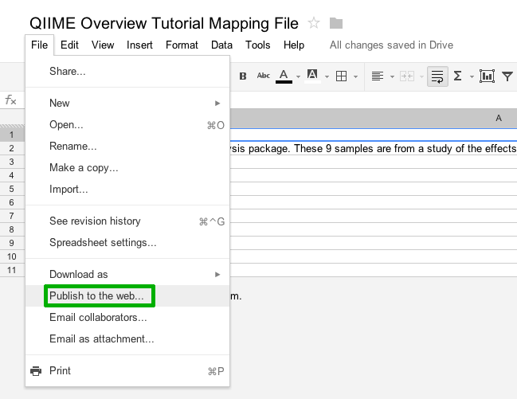
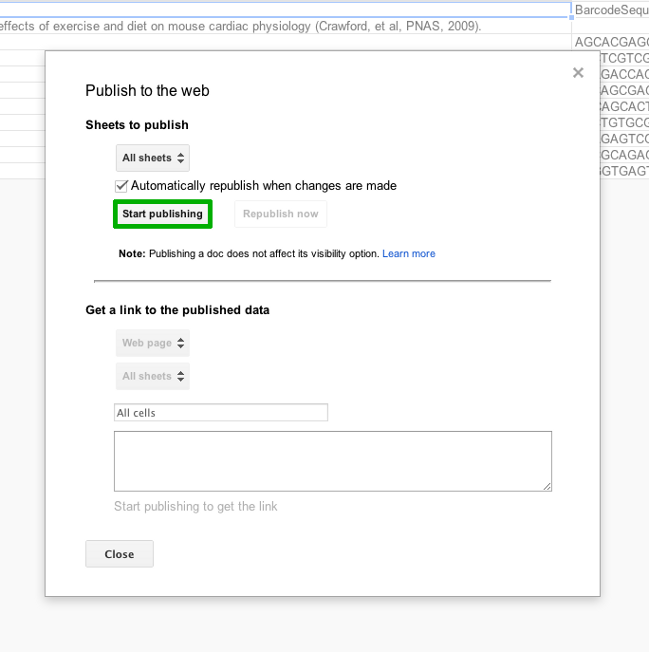
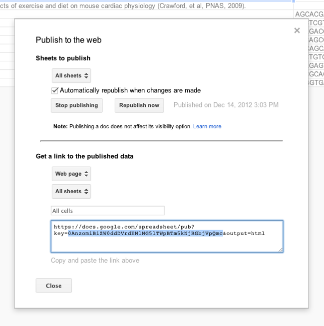

.. _remote_mapping_files:

==========================
Using Remote Mapping Files
==========================

Introduction
------------
This tutorial explains how to use metadata mapping files that are stored remotely (i.e. not on your local machine) with QIIME. Currently, the only type of remote mapping file that is supported is a Google Spreadsheet, though other methods of remote storage/retrieval may be supported in the future. Thus, for the rest of this tutorial, we will focus on how to use mapping files stored in Google Spreadsheets with QIIME.

**Note:** For more information regarding the QIIME mapping file format, please see the `QIIME file formats documentation <../documentation/file_formats.html>`_.

A remote mapping file has several advantages over the traditional locally-stored mapping file:

* **It enables collaboration.** By storing the mapping file in a place that can be easily accessed by all members of a project, collaboration becomes easier because now you only have to share a simple URL instead of copying files back-and-forth between computers.

* **It prevents mistakes.** By using a remote mapping file, you ensure that everyone in your project is using the *definitive* version of the mapping file. This is especially important for studies where metadata is often changing. It ensures that no-one is accidentally using an old or outdated version of the file.

* **It is convenient.** By using QIIME's remote mapping file functionality, you won't have to continually export your spreadsheet (from Google Docs, Excel, etc.) into TSV format. This is all taken care of for you behind-the-scenes.

Prerequisites
-------------
Before you can use your Google Spreadsheet mapping file with QIIME, you will need to take the following steps.

**Ensure you have an active Internet connection.** You will need to be connected to the Internet in order to retrieve the remote mapping file.

**Install the gdata Python package.** This is an optional dependency for QIIME, but is required if you plan to use a remote mapping file. Please see the `instructions for installing QIIME natively <../install/install.html>`_ for more details (version information, etc.). If you are using QIIME in the VirtualBox or on EC2, this package will have already been installed for you.

**Publish your spreadsheet to the web.** This step is necessary because QIIME will connect to the spreadsheet without authentication, and Google currently only provides unauthenticated access to spreadsheets that are published to the web. Note that this is different than **public on the web**, which you will not be able to connect to. The following screenshots illustrate how to publish your spreadsheet to the web:

Figure 1: Selecting 'Publish to the web' from within Google Docs.

Figure 2: Publishing your spreadsheet to the web.

**Note:** When publishing to the web, this *does not* change the visibility options of your original spreadsheet. It is also important to note that Google Docs gives you an option to automatically republish the spreadsheet anytime changes are made to the original- make sure to select the correct option based on whether you want users to see all changes that are made to the spreadsheet, or if you'd rather selectively publish the spreadsheet at your own discretion.

**Select your spreadsheet key.** After publishing your spreadsheet to the web, Google Docs will supply you with a URL that can be used to access the published spreadsheet. Select the key (see Figure 3 below) and copy it. This key will be used by QIIME to identify your spreadsheet. You may also wish to note the name of the worksheet (spreadsheets contain multiple worksheets) that contains the mapping file, if you have more than one worksheet in your spreadsheet. The names of the worksheets can be found in the lower lefthand corner of the Google Spreadsheet.

Figure 3: Selecting your spreadsheet key.

You are now ready to use your Google Spreadsheet with QIIME!

How do I use a remote mapping file with QIIME?
----------------------------------------------
The script `load_remote_mapping_file.py <../scripts/load_remote_mapping_file.html>`_ allows you to export and download a remote mapping file (currently a Google Spreadsheet) to your local machine. This removes the steps of navigating to Google Docs in a web browser and exporting the spreadsheet as TSV each time you need to obtain the latest published version of the spreadsheet.

To obtain a local copy of the `QIIME overview tutorial <./tutorial.html>`_ mapping file stored in Google Docs, run the following command: ::

    load_remote_mapping_file.py -o Fasting_Map.txt -k 0AnzomiBiZW0ddDVrdENlNG5lTWpBTm5kNjRGbjVpQmc

The -o option specifies the filename to save the mapping file to, and -k specifies the key that we previously copied. Open up :file:`Fasting_Map.txt` to see the mapping file in TSV (QIIME-compatible) format:

.. note::

    * #SampleID	BarcodeSequence	LinkerPrimerSequence	Treatment	DOB	Description
    * #Example mapping file for the QIIME analysis package.  These 9 samples are from a study of the effects of exercise and diet on mouse cardiac physiology (Crawford, et al, PNAS, 2009).
    * PC.354	AGCACGAGCCTA	YATGCTGCCTCCCGTAGGAGT	Control	20061218	Control_mouse_I.D._354
    * PC.355	AACTCGTCGATG	YATGCTGCCTCCCGTAGGAGT	Control	20061218	Control_mouse_I.D._355
    * PC.356	ACAGACCACTCA	YATGCTGCCTCCCGTAGGAGT	Control	20061126	Control_mouse_I.D._356
    * PC.481	ACCAGCGACTAG	YATGCTGCCTCCCGTAGGAGT	Control	20070314	Control_mouse_I.D._481
    * PC.593	AGCAGCACTTGT	YATGCTGCCTCCCGTAGGAGT	Control	20071210	Control_mouse_I.D._593
    * PC.607	AACTGTGCGTAC	YATGCTGCCTCCCGTAGGAGT	Fast	20071112	Fasting_mouse_I.D._607
    * PC.634	ACAGAGTCGGCT	YATGCTGCCTCCCGTAGGAGT	Fast	20080116	Fasting_mouse_I.D._634
    * PC.635	ACCGCAGAGTCA	YATGCTGCCTCCCGTAGGAGT	Fast	20080116	Fasting_mouse_I.D._635
    * PC.636	ACGGTGAGTGTC	YATGCTGCCTCCCGTAGGAGT	Fast	20080116	Fasting_mouse_I.D._636

To update this mapping file at a later time, simply rerun the above command (note that you'll lose any local changes you may have made to the mapping file, so please be cautious!).

If your spreadsheet has multiple worksheets (i.e. tabs), `load_remote_mapping_file.py <../scripts/load_remote_mapping_file.html>`_  will by default choose the first worksheet as the one it will export. You can override this behavior by using the -w option and providing the name of the worksheet.

You may also specify the entire URL of the Google Spreadsheet (instead of only supplying the key) using the same -k option that we used above. The script will attempt to extract the key from the URL.

**Note:** Now that we have a local copy of our mapping file, it is a good idea to run `check_id_map.py <../scripts/check_id_map.html>`_ on the mapping file to make sure it is a valid mapping file and that there weren't any problems during the export/download process.

Caveats
-------
Please keep the following caveats in mind when using the remote mapping file functionality in QIIME:

* If your spreadsheet contains blank lines, only the rows **up to** to the first blank line will be exported and downloaded. This is currently a limitation of the Google Spreadsheet API.

* If any headers (i.e. in the first row of the spreadsheet) are empty, the entire column will be ignored during the export.

Upcoming Features
-----------------
Remote mapping files are very new to QIIME and are thus an experimental feature. We plan to add additional support for remote mapping files in the future, including the following features:

* Seamless integration with existing QIIME scripts to allow a remote mapping file to be specified directly as input (without having to run `load_remote_mapping_file.py <../scripts/load_remote_mapping_file.html>`_ beforehand).

* Option to run `check_id_map.py <../scripts/check_id_map.html>`_ as part of the remote mapping file fetching process. Option to have offending fields highlighted in Google Spreadsheet for visual feedback.

* Ability to authenticate users to allow access to spreadsheets that are not "published to the web" and to allow edits.
