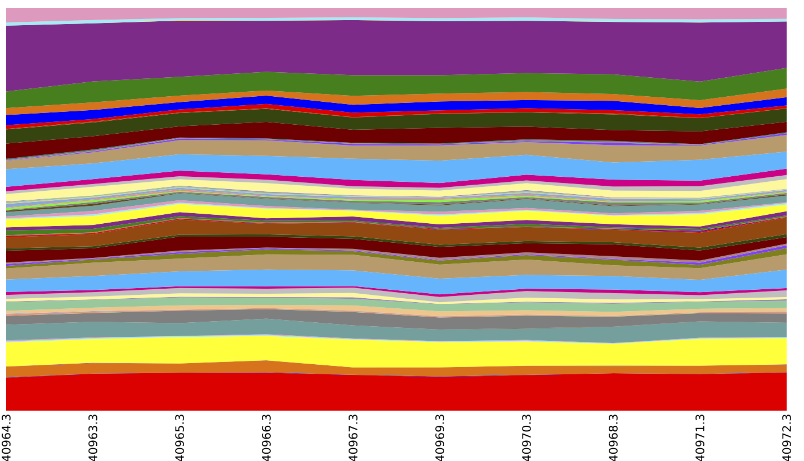
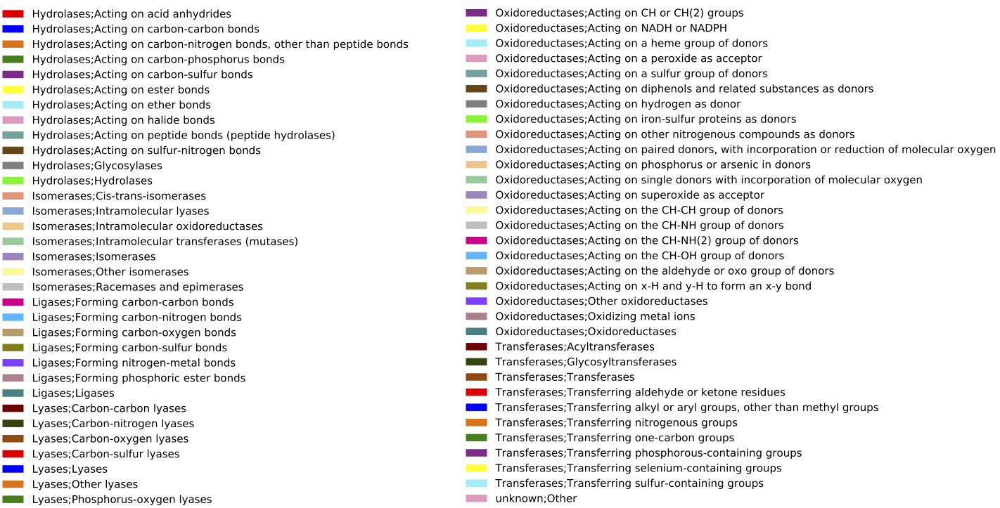

.. _shotgun_analysis:

===================================
Analysis of shotgun sequencing data
===================================

.. warning:: WARNING: Analysis of Shotgun sequencing (i.e., non-amplicon) data in QIIME is experimental. Use at your own risk!

.. warning:: WARNING: This tutorial is based on Guerrero Negro microbial mat metagenome data. This data was generated on Sanger, and contains approximately 120k sequences. The mapping step in this tutorial requires 50 processor hours to run, so in general it's probably not easily reproducible. We're in the process of figuring out how to make these analyses more scalable, but in the meantime this data is here for other to experiment with. Selecting subsets of this data that run faster gives less meaningful results, so consider this tutorial a work in progress.

QIIME can perform translated search to assign nucleic acid sequence reads to a reference database containing protein sequences. We presently support assignment using ``usearch`` and ``blat``, and are actively working on additional methods. Our preferred method is currently ``blat`` as it supports comparison against large reference collections free of charge. While 32-bit ``usearch`` is free for academic and non-profit use, protein reference databases frequently require 64-bit ``usearch``, which is not free (even for non-profit or academic users, as of this writing). The following steps illustrate how to do read assignment with ``blat``, but ``usearch`` can be used in any of these steps by substituting ``-m blat`` for ``-m usearch``.

This tutorial is based on Guerrero Negro microbial mat metagenome data. This data was generated on Sanger, and contains approximately 120k sequences. You should begin by obtaining that data with the following command::
	
	curl -O https://s3.amazonaws.com/s3-qiime_tutorial_files/shotgun_analysis_gn.tgz

See below for the relevant references for this data set.

Begin by unzipping the resulting file and changing into that directory::
	
	tar -xvzf shotgun_analysis_gn.tgz
	cd shotgun_analysis_gn

Because this tutorial can take a long time to run, we provide the output from all steps for review. If you'd like to run the steps yourself, either remove or rename the ``blat_mapped`` directory::
	
	mv blat_mapped blat_mapped_original

Reference databases
-------------------

A key step in assigning reads is deciding on a reference database, and this is an active area of research. Several choices are IMG, KEGG, and M5nr. To use one of these databases with QIIME, you'll need a single fasta file with all sequence records. If you'd like to associate metadata with these records you'll also need an observation metadata file. In this tutorial we work with the IMG database and KEGG ortholog (KO) codes associated with all records. You can download that file from the `QIIME resources page <http://qiime.org/home_static/dataFiles.html>`_ (see IMG reference protein sequences).

Defining environment variables for use in this tutorial
-------------------------------------------------------

Begin by defining some environment variables to easily refer to the reference sequences and associated metadata. In the QIIME Virtual Machines, this would look like this::

	export QIIME_DIR=$HOME/qiime_software
	export reference_seqs=$QIIME_DIR/img-qiime-***/aa_seqs.faa
	export reference_md=$QIIME_DIR/img-qiime-***/gene_ko_pathway.txt

where ``img-qiime-***`` will be specific to the version of the reference dataset you downloaded from the `QIIME resources page <http://qiime.org/home_static/dataFiles.html>`_.

Assigning nucleotide reads to protein reference sequences
---------------------------------------------------------

The script used for assigning nucleotide reads to protein reference sequences is ``map_reads_to_reference.py``, and the parallel version, ``parallel_map_reads_to_reference.py``. You can run this as follows::

	map_reads_to_reference.py -s 0.55 -i seqs.fna -o blat_mapped/ -r $reference_seqs -t $reference_md -m blat

Or to run in parallel on four processors (``-O``), you could run::

	parallel_map_reads_to_reference.py -s 0.55 -i seqs.fna -o blat_mapped/ -r $reference_seqs -t $reference_md -O 4 -m blat -T

Several output files will be generated during this process. Most important for downstream analysis is ``observation_table.biom``, the `BIOM file <http://www.biom-format.org>`_, which contains the sample-by-gene count matrix. This file, along with your metadata mapping file, is central for down-stream analyses. (Note that running in parallel without the -T flag requires an additional step to create the .biom file).

Computing beta diversity and generating PCoA plots
--------------------------------------------------

Next we show how to compute beta diversity between samples and generate principal coordinate plots. For this step you'll use ``beta_diversity_through_plots.py`` with a parameters file that specifies what beta diversity metrics you'll use. The tutorial data contains a parameters file (``shotgun_bdiv_params.txt``) that can be used here. That file contains the following line::

	beta_diversity:metrics bray_curtis

which specifies that we want to compute Bray-Curtis distances between the samples. You can run this as follows::

	beta_diversity_through_plots.py -i blat_mapped/observation_table.biom -e 2159 -o blat_mapped/bdiv_even2159/ -p shotgun_bdiv_params.txt -m map.txt

This step will create an output directory (``blat_mapped/bdiv_even2159/``). To view interactive 3D PCoA plots you can open ``blat_mapped/bdiv_even2159/bray_curtis_3d_continuous/bray_curtis_pc_3D_PCoA_plots.html``.

.. image:: ../images/shotgun_analysis_gn_pcoa.png
	:height: 300 px

Above is a 2D PCoA plot of these data. Points are colored by Layer in the microbial mat: `hot` colors represent top layers in the mat which `cold` colors represent the bottom layers in the mat. You can access the 2D plots by opening ``blat_mapped/bdiv_even2159/bray_curtis_2d_continuous/bray_curtis_pc_2D_PCoA_plots.html``.

Collapsing functions for computation of beta diversity
------------------------------------------------------

One thing that can be useful in comparing samples is to collapse genes by their metadata categories so, for example, all counts of genes in the same level 3 EC category are collapsed to a single category, and then compute beta diversity. This gives a coarser view of the data by collapsing related genes to observations of functions (rather than observations of specific genes). This can be achieved with the following steps::

	summarize_taxa.py -i blat_mapped/observation_table.biom -o blat_mapped/ko_tables/ -L 2,3,4 -a
	convert_biom.py -i blat_mapped/ko_tables/observation_table_L3.txt -o blat_mapped/ko_tables/observation_table_L3.biom --biom_table_type "function table"
	beta_diversity_through_plots.py -i blat_mapped/ko_tables/observation_table_L3.biom -e 2159 -o blat_mapped/bdiv_l3_even2159/ -p shotgun_bdiv_params.txt -m map.txt

Generating summaries of samples by KO category
----------------------------------------------

Finally, you may want to generate summaries of the samples based on their KO composition. We first sort the BIOM table so samples will be ordered by the ``Layer`` metadata field (corresponding to depth in the microbial mat). We can then generate area and box plots showing the Level 2, 3, and 4 composition of each metagenome::

	sort_otu_table.py -i blat_mapped/observation_table.biom -o blat_mapped/observation_table.Layer_sorted.biom -m map.txt -s Layer
	summarize_taxa_through_plots.py -i blat_mapped/observation_table.Layer_sorted.biom -o blat_mapped/ko_summary_plots

Above is an summary of EC by layer (which could be achieved by running ``export reference_md $QIIME_DIR/img-ref-arp14sept2012/gene_ko_pathway.txt`` prior to the ``map_reads_to_reference.py`` step of this tutorial), collapsed at EC Level 2. 

A note on input data
--------------------
This tutorial assumes that data is provided in post-split-libraries format, as with the ``seqs.fna`` file used here. If you obtain Illumina data in fastq files with one sample/metagenome per fasta file, you can use ``split_libraries_fastq.py`` in ``not-barcoded`` mode, and then concatenate the resulting files. For example::

	split_libraries_fastq.py -i lane1_read1.fastq.gz --sample_id sample.1 -o sample.1.slout/ -m map_not_multiplexed.txt --barcode_type 'not-barcoded'
	split_libraries_fastq.py -i lane2_read1.fastq.gz --sample_id sample.2 -o sample.2.slout/ -m map_not_multiplexed.txt --barcode_type 'not-barcoded'
	...
	cat sample.1.slout/seqs.fna sample.2.slout/seqs.fna >> seqs.fna

Where ``...`` indicates that you should run this for each of your input fastq files (which can be provided as fastq or fastq.gz).

References
----------
The following articles describe to the data used in this tutorial:

Ley RE, Harris JK, Wilcox J, Spear JR, Miller SR, Bebout BM et al. (2006). Unexpected diversity and complexity of the Guerrero Negro hypersaline microbial mat. Appl Environ Microbio 72: 3685–3695.

Harris JK, Caporaso JG, Walker JJ, Spear JR, Gold NJ, Robertson CE, Hugenholtz, P, et al. (2012). Phylogenetic stratigraphy in the Guerrero Negro hypersaline microbial mat. The ISME Journal, doi:10.1038/ismej.
