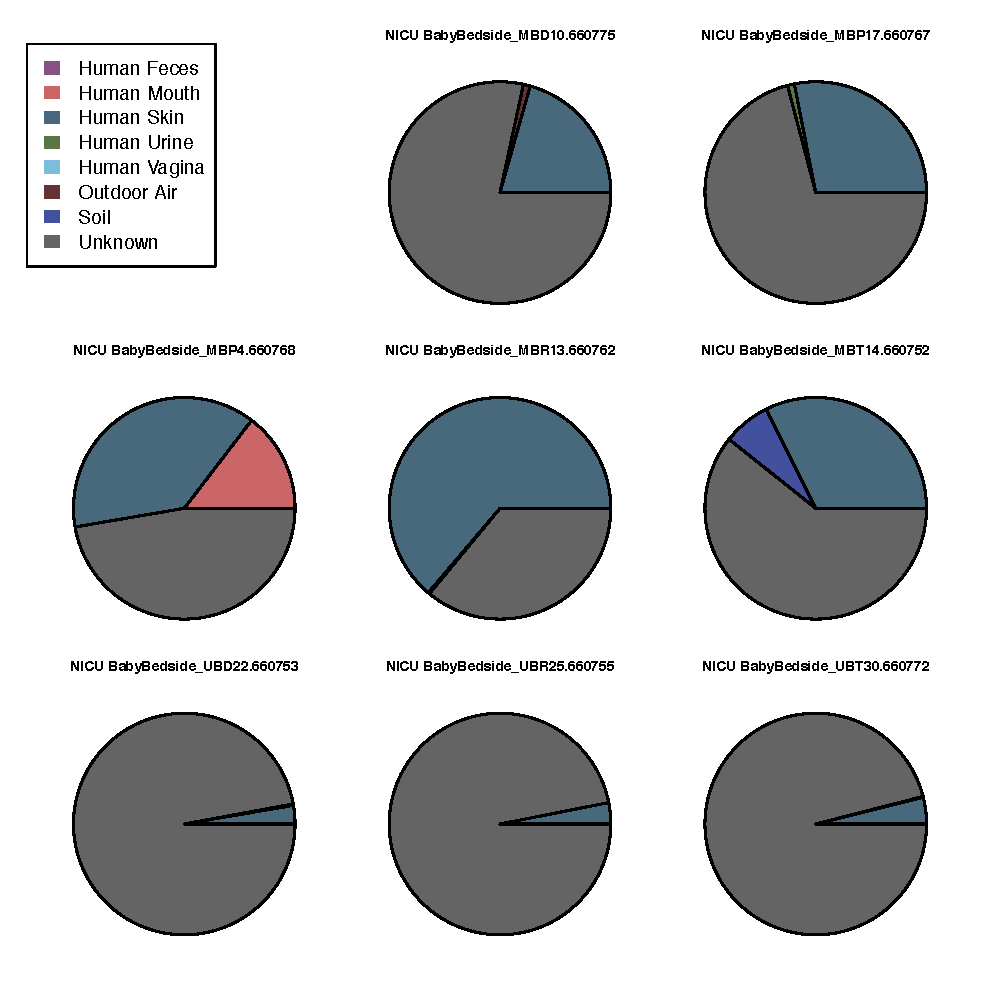

.. _source_tracking:

==================================================
Tracking the source of microbes with SourceTracker
==================================================

Introduction
------------
This tutorial illustrations how to use the `SourceTracker <http://sourceforge.net/projects/sourcetracker/>`_ 0.9.5 software with QIIME. SourceTracker is designed to predict the source of microbial communities in a set of input samples (i.e., the sink samples). See `Knights (2011) <http://www.nature.com/nmeth/journal/v8/n9/full/nmeth.1650.html>`_ for the original paper on SourceTracker.

This tutorial does not attempt to cover every possible usage of SourceTracker. Instead, it provide an example of how to use the basic framework in your own analyses.

Tutorial data
-------------
You can obtain the files used in this tutorial `here <https://s3.amazonaws.com/s3-qiime_tutorial_files/sourcetracker_tutorial_files.tgz>`_. These are derived from `Hewitt et al., 2013 <http://www.plosone.org/article/info%3Adoi%2F10.1371%2Fjournal.pone.0054703>`_, where samples were collected from various surfaces in two different Neonatal Intensive Care Units (NICUs). The 16S rRNA was sequenced from these samples, and compared against pre-existing data sets using SourceTracker in order to predict the likely origin of the microbial contaminants on each NICU surface.

This tutorial begins with an OTU table. For information on various ways to generate OTU tables with QIIME, see :ref:`otu_picking`.

Test Usage
----------
Before running SourceTracker check to see if it installed and accessible to QIIME::

    print_qiime_config.py -t

You should see the following line in the output if SourceTracker is properly installed::

	sourcetracker is installed ... ok

For information on interacting with SourceTracker, run the following command to get SourceTracker's help text::

    R --slave --vanilla --args -h < $SOURCETRACKER_PATH/sourcetracker_for_qiime.r

(The ``$SOURCETRACKER_PATH`` environment variable referenced here will be defined if SourceTracker is correctly installed.)

Filter OTUs present in less than 1% of the samples from the OTU table
---------------------------------------------------------------------
First we filter OTUs that are present in very few samples, as we consider these unlikely to provide useful source tracking information. We define *very few samples* here as less than 1% of the samples, which in our case is roughly 7 samples. This value should be determined on a per-study basis (so you shouldn't just use 7 on your own data). You can find the total number of samples in your OTU table by running the ``biom summarize-table`` command on it. 

To filter the OTU table, run the following command::

    filter_otus_from_otu_table.py -i otu_table.biom -o filtered_otu_table.biom -s 7

This command will create an output file named ``filtered_otu_table.biom``, which only contains OTUs that appear in at least 7 samples. To see how many OTUs were filtered in this process, you can run the ``biom summarize-table`` command and compare *Num observations* for ``otu_table.biom`` and ``filtered_otu_table.biom``. It's not uncommon to filter a large percentage (e.g., greater than 50%) of your OTUs using this process.

Convert table from BIOM to tab-separated text format
----------------------------------------------------
SourceTracker does not work with the `BIOM format <http://www.biom-format.org>`_, so the OTU table needs to be converted to tab-separated text format. You can do that with the following command::

    biom convert -i filtered_otu_table.biom -o filtered_otu_table.txt -b

This creates a file named ``filtered_otu_table.txt``.

Run SourceTracker
-----------------

To use SourceTracker, your mapping must contain two columns titled ``SourceSink``, and ``Env``, which define whether each sample should be treated as a source or a sink, and describe the sample type, respectively. These columns can be added to your mapping file by opening it in Excel or as a Google Spreadsheet and adding the new columns. 

In the tutorial data set the sources include ``Outdoor Air``, ``Human Skin``, and ``Human Mouth``. Each row that represents a sample taken from one of these should be labeled ``source`` in the ``SourceSink`` column. Likewise the sink samples (including ``NICU Incubator``, ``NICU BabyBedside`` here) should be labeled ``sink`` in the ``SourceSink`` column. Each row in the ``Env`` column should contain a description of the corresponding sample type, for example ``Outdoor Air``, ``Human Skin``, and ``NICU BabyBedside``. Any sample that should not be used in the SourceTracker analysis should contain ``NA`` in the ``SourceSink`` and ``Env`` columns. These steps have all been completed in the mapping file used in this tutorial (``map.txt``). You can review that file as you prepare a mapping file for your own analyses.

You can run SourceTracker with the following command::

    R --slave --vanilla --args -i filtered_otu_table.txt -m map.txt -o sourcetracker_out < $SOURCETRACKER_PATH/sourcetracker_for_qiime.r

This will take a few minutes to run. Once it's complete, you can open ``sourcetracker_out/sink_predictions_pie_NICU BabyBedside.pdf`` to view an example of the output. That file should look like this:

These pie charts represent the likely origin of microbial communities from each sample taken from the ``BabyBedside``. Each of the colors in a pie chart represent one of the sources that were denoted in the mapping file. The ``sourcetracker_out/sink_predictions.txt`` file contains the raw data for these pie charts.

References
----------

Knights, Dan et al. "Bayesian community-wide culture-independent microbial source tracking." Nature Methods (2011) (`link <http://www.nature.com/nmeth/journal/v8/n9/full/nmeth.1650.html>`_)

Hewitt, Krissi M et al. "Bacterial Diversity in Two Neonatal Intensive Care Units (NICUs)." PLOS ONE (2013) (`link <http://www.plosone.org/article/info%3Adoi%2F10.1371%2Fjournal.pone.0054703>`_)
