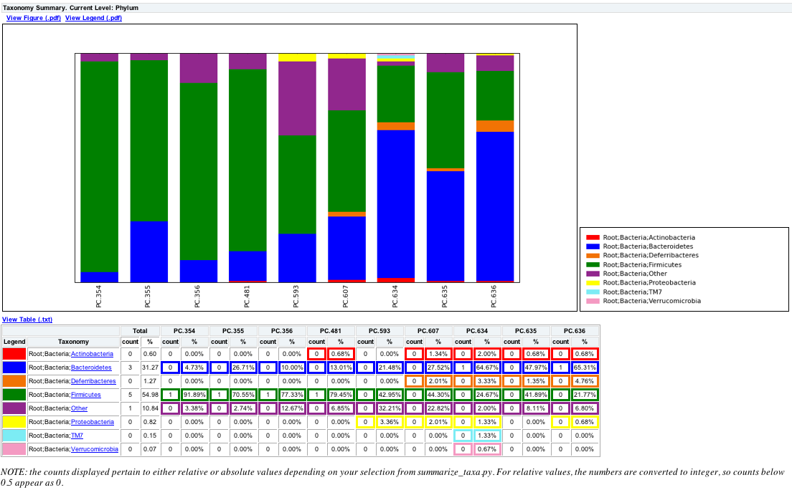

.. _generate_taxa_summaries:

==============================
Generating Taxonomy Summaries
==============================

This document describes how to perform taxonomy summaries for samples or for categories from a users mapping file. We will also illustrate the use of a sorting script that will allow users to sort their OTU table, so the charts will represent that order.

Here we will illustrate how to generate summarized taxonomy charts using the QIIME tutorial dataset.

Step 1. Sort OTU Table by Category in Mapping File (Optional)
-----------------------------------------------------------------------
Users can sort their OTU table using the mapping file and `sort_otu_table.py <../scripts/sort_otu_table.html>`_ script

::
	
	sort_otu_table.py -i seqs_otu_table.txt -o seqs_otu_table_sorted_by_DOB.txt -m Fasting_Map.txt -s DOB
	
	
The resulting OTU Table will look something like the following, where the samples are sorted by the mouse date of birth:
::
	
	#OTU ID PC.356	PC.354	PC.355	PC.481	PC.607	PC.593	PC.634	PC.635	PC.636	Consensus Lineage
	0	0	0	0	0	0	0	0	1	0	Root;Bacteria;Firmicutes;"Clostridia";Clostridiales;"Lachnospiraceae"
	1	0	0	0	0	1	0	0	0	0	Root;Bacteria;Firmicutes;"Clostridia";Clostridiales;"Lachnospiraceae"

where 0 and 1 are OTU ids, and PC.* are sample ids.
	
Step 2. Summarize OTU Table by Mapping Category (Optional)
--------------------------------------------------------------------
Users can summarize their OTU table using one of the column headers in the mapping file and `summarize_otu_by_cat.py <../scripts/summarize_otu_by_cat.html>`_ script. 

.. note::

    * If the user performed Step 1, then this script will override the OTU table order, since it is combining samples into the category defined.

::
	
	summarize_otu_by_cat.py -i Fasting_Map.txt -c seqs_otu_table.txt -m Treatment
	
The resulting OTU Table (:file:`Treatment_otu_table.txt`) will have category ids instead of sample ids as shown below. 

.. note:: 

    * The categories are sorted by the order they are listed in your mapping file:

::
	
	#Category OTU Counts-Treatment
	#OTU ID Fast	Control Consensus Lineage
	0	1	0	Root; Bacteria; Firmicutes; "Clostridia"; Clostridiales; "Lachnospiraceae"
	1	1	0	Root; Bacteria; Firmicutes; "Clostridia"; Clostridiales; "Lachnospiraceae"

where 0 and 1 are OTU ids, and Fast/Control are the category ids.
	
Step 3. Summarize Taxa in OTU Table
------------------------------------------------------------------------------------------
For summarizing the taxa, the following will illustrate the usage based on whether the user performed either Steps 1, 2 or neither, where the user can use the `summarize_taxa.py <../scripts/summarize_taxa.html>`_ script. For each of the following examples, we will summarize the taxa at the Phylum level (3).  

Example 1: case where the user did not perform Steps 1 or 2.
==============================================================
::
	
	summarize_taxa.py -L 3 -i seqs_otu_table.txt -o seqs_otu_table_summarized.txt

The resulting summarized taxa will look something like:
::

    Taxon	PC.354	PC.355	PC.356	PC.481	PC.593	PC.607	PC.634	PC.635	PC.636
    Root;Bacteria;Actinobacteria	0.0	0.0	0.0	0.00684931506849	0.0	0.0134228187919	0.02	0.00675675675676	0.00680272108844
    Root;Bacteria;Bacteroidetes	0.0472972972973	0.267123287671	0.1	0.130136986301	0.214765100671	0.275167785235	0.646666666667	0.47972972973	0.65306122449

where Root;Bacteria;* are Taxa, and PC.* are the sample ids.

Example 2: case where the user performed Step 1.
==============================================================
::

    summarize_taxa.py -L 3 -i seqs_otu_table_sorted_by_DOB.txt -o seqs_otu_table_sorted_by_DOB_summarized.txt

The resulting summarized taxa will look something like:
::

    Taxon	PC.356	PC.354	PC.355	PC.481	PC.607	PC.593	PC.634	PC.635	PC.636
    Root;Bacteria;Actinobacteria	0.0	0.0	0.0	0.00684931506849	0.0134228187919	0.0	0.02	0.00675675675676	0.00680272108844
    Root;Bacteria;Bacteroidetes	0.1	0.0472972972973	0.267123287671	0.130136986301	0.275167785235	0.214765100671	0.646666666667	0.47972972973	0.65306122449

where Root;Bacteria;* are Taxa, and PC.* are the category ids, but note that the order of the sample ids are based on the DOB category in the mapping file.

Example 3: case where the user performed Step 2.
==============================================================
::

	summarize_taxa.py -L 3 -i Treatment_otu_table.txt -o Treatment_otu_table_summarized.txt

The resulting summarized taxa will look something like:	
::
    
    Taxon	Fast	Control
    Root;Bacteria;Actinobacteria	0.0117845117845	0.00135317997294
    Root;Bacteria;Bacteroidetes	0.513468013468	0.151556156969

where Root;Bacteria;* are Taxa, and Fast/Control are the category ids.

Step 4. Generate the Summarized Taxa Charts
--------------------------------------------------
Now that the user has summarized the taxa, they can generate area, bar or pie charts for their data using `plot_taxa_summary.py <../scripts/plot_taxa_summary.html>`_. Here we will generate bar charts with a white background for each example from the previous step:

Example 1: case where the user did not perform Steps 1 or 2.
==============================================================
::
	
	plot_taxa_summary.py -i seqs_otu_table_summarized.txt -l Phylum -o bar_charts -c bar -k white

The resulting plot should look like the following:

   
Example 2: case where the user performed Step 1.
==============================================================
::

	plot_taxa_summary.py -i seqs_otu_table_summarized.txt -l Phylum -o bar_charts -c bar -k white

The resulting plot should look like the following and notice that PC.356 is now the first sample based on the sorting of sample ids from Step 1:

.. image:: ../images/barchartex2.png
  :align: center
  
Example 3: case where the user performed Step 2.
==============================================================
::

	plot_taxa_summary.py -i seqs_otu_table_summarized.txt -l Phylum -o bar_charts -c bar -k white

The resulting plot should look like the following:

.. image:: ../images/barchartex3.png
 :align: center