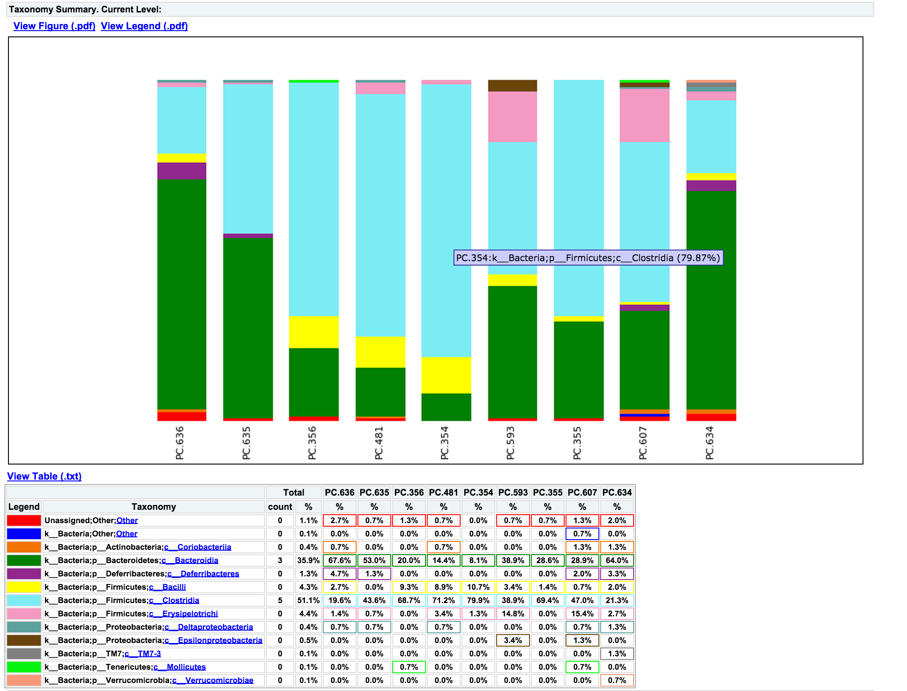

.. _tutorial:

================================================================================
454 Overview Tutorial: de novo OTU picking and diversity analyses using 454 data
================================================================================

Introduction
-------------
This tutorial explains how to use the **QIIME** (Quantitative Insights Into Microbial Ecology) Pipeline to process data from high-throughput 16S rRNA sequencing studies. If you have not already installed qiime, please see the section `Installing Qiime <../install/index.html>`_ first. The purpose of this pipeline is to provide a start-to-finish workflow, beginning with multiplexed sequence reads and finishing with taxonomic and phylogenetic profiles and comparisons of the samples in the study. With this information in hand, it is possible to determine biological and environmental factors that alter microbial community ecology in your experiment.

As an example, we will use data from a study of the response of mouse gut microbial communities to fasting (Crawford et al., 2009). To make this tutorial run quickly on a personal computer, we will use a subset of the data generated from 5 animals kept on the control ad libitum fed diet, and 4 animals fasted for 24 hours before sacrifice. At the end of our tutorial, we will be able to compare the community structure of control vs. fasted animals. In particular, we will be able to compare taxonomic profiles for each sample type, differences in diversity metrics within the samples and between the groups, and perform comparative clustering analysis to look for overall differences in the samples.

In this walkthrough, text like the following: ::

    print_qiime_config.py

denotes the command-line invocation of scripts. You can find full usage information for each script by passing the -h option (help) and/or by reading the full description in the `Documentation <../documentation/index.html>`_. Execute all tutorial commands from within the :file:`qiime_tutorial` directory, which can be downloaded from here: `QIIME Tutorial files <ftp://thebeast.colorado.edu/pub/qiime-files/qiime_tutorial.zip>`_.

To process our data, we will perform the following analyses, each of which is described in more detail below:

* Filter the DNA sequence reads for quality and assign multiplexed reads to starting samples by nucleotide barcode .
* Pick Operational Taxonomic Units (OTUs) based on sequence similarity within the reads, and pick a representative sequence from each OTU.
* Assign the OTU to a taxonomic identity using reference databases.
* Align the OTU sequences and create a phylogenetic tree.
* Calculate diversity metrics for each sample and compare the types of communities, using the taxonomic and phylogenetic assignments.
* Generate UPGMA and PCoA plots to visually depict the differences between the samples, and dynamically work with these graphs to generate publication quality figures.

Essential Files
----------------
All the files you will need for this tutorial are here (ftp://thebeast.colorado.edu/pub/qiime-files/qiime_tutorial.zip). Descriptions of these files are below.

Sequences (.fna)
^^^^^^^^^^^^^^^^^^^^^^^^^^^^^^^^^^^^^^^^^^^^^^^^^^^^^^^^^^^^^^^^^^^^^^^^^
This is the 454-machine generated FASTA file. Using the Amplicon processing software on the 454 FLX standard, each region of the PTP plate will yield a fasta file of form :file:`1.TCA.454Reads.fna`, where "1" is replaced with the appropriate region number. For the purposes of this tutorial, we will use the fasta file :file:`Fasting_Example.fna`.

Quality Scores (.qual)
^^^^^^^^^^^^^^^^^^^^^^^^^^^^^^^^^^^^^^^^^^^^^^^^^^^^^^^^^^^^^^^^^^^^^^^^^
This is the 454-machine generated quality score file, which contains a score for each base in each sequence included in the FASTA file. Like the fasta file mentioned above, the Amplicon processing software will generate one of these files for each region of the PTP plate, named :file:`1.TCA.454Reads.qual`, etc. For the purposes of this tutorial, we will use the quality scores file :file:`Fasting_Example.qual`.

Mapping File (Tab-delimited .txt)
^^^^^^^^^^^^^^^^^^^^^^^^^^^^^^^^^^^^^^^^^^^^^^^^^^^^^^^^^^^^^^^^^^^^^^^^^
The mapping file is generated by the user. This file contains all of the information about the samples necessary to perform the data analysis. At a minimum, the mapping file should contain the name of each sample, the barcode sequence used for each sample, the linker/primer sequence used to amplify the sample, and a Description column. In general, you should also include in the mapping file any metadata that relates to the samples (for instance, health status or sampling site) and any additional information relating to specific samples that may be useful to have at hand when considering outliers (for example, what medications a patient was taking at time of sampling). Of note: the sample names may only contain alphanumeric characters (A-z) and the dot (.). Full format specifications can be found in the Documentation (`File Formats <../documentation/file_formats.html>`_).

For the purposes of this tutorial, we will use the mapping file :file:`Fasting_Map.txt`. The contents of the mapping file are shown here - as you can see, a nucleotide barcode sequence is provided for each of the 9 samples, as well as metadata related to treatment group and date of birth, and general run descriptions about the project. Fasting_Map.txt file contents:

.. note::

   * #SampleID  BarcodeSequence LinkerPrimerSequence    Treatment DOB   Description
   * #Example mapping file for the QIIME analysis package. These 9 samples are from a study of the effects of
   * #exercise and diet on mouse cardiac physiology (Crawford, et al, PNAS, 2009).
   * PC.354 AGCACGAGCCTA    YATGCTGCCTCCCGTAGGAGT   Control 20061218    Control_mouse__I.D._354
   * PC.355 AACTCGTCGATG    YATGCTGCCTCCCGTAGGAGT   Control 20061218    Control_mouse__I.D._355
   * PC.356 ACAGACCACTCA    YATGCTGCCTCCCGTAGGAGT   Control 20061126    Control_mouse__I.D._356
   * PC.481 ACCAGCGACTAG    YATGCTGCCTCCCGTAGGAGT   Control 20070314    Control_mouse__I.D._481
   * PC.593 AGCAGCACTTGT    YATGCTGCCTCCCGTAGGAGT   Control 20071210    Control_mouse__I.D._593
   * PC.607 AACTGTGCGTAC    YATGCTGCCTCCCGTAGGAGT   Fast    20071112    Fasting_mouse__I.D._607
   * PC.634 ACAGAGTCGGCT    YATGCTGCCTCCCGTAGGAGT   Fast    20080116    Fasting_mouse__I.D._634
   * PC.635 ACCGCAGAGTCA    YATGCTGCCTCCCGTAGGAGT   Fast    20080116    Fasting_mouse__I.D._635
   * PC.636 ACGGTGAGTGTC    YATGCTGCCTCCCGTAGGAGT   Fast    20080116    Fasting_mouse__I.D._636

.. _checkmapping:

Check Mapping File
--------------------------------------------------------------------
Before beginning with QIIME, you should ensure that your mapping file is formatted correctly with the `check_id_map.py <../scripts/check_id_map.html>`_ script. Type: ::

    check_id_map.py -m Fasting_Map.txt -o mapping_output

This utility will display a message indicating whether or not problems were found in the mapping file. A HTML file showing the location of errors and warnings will be generated in the output directory, and will also be written to the output to a log file. Errors will cause fatal problems with subsequent scripts and must be corrected before moving forward. Warnings will not cause fatal problems, but it is encouraged that you fix these problems as they are often indicative of typos in your mapping file, invalid characters, or other unintended errors that will impact downstream analysis. A :file:`corrected_mapping.txt` file will also be created in the output directory, which will have a copy of the mapping file with invalid characters replaced by underscores.

Reverse primers can be specified in the mapping file, for removal during the demultiplexing step.  This is not required, but it is STRONGLY recommended, as leaving in sequences following primers, such as sequencing adapters, can interfere with OTU picking and taxonomic assignment.

An example mapping file with faux reverse primers specified, using the ReversePrimer field, is available here:  `reverse primer mapping file <../_static/Examples/File_Formats/Fasting_Map_reverse_primers.txt>`_.

.. note::

   * #SampleID  BarcodeSequence LinkerPrimerSequence    Treatment ReversePrimer   Description
   * #Example mapping file for the QIIME analysis package. These 9 samples are from a study of the effects of
   * #exercise and diet on mouse cardiac physiology (Crawford, et al, PNAS, 2009).
   * PC.354 AGCACGAGCCTA    YATGCTGCCTCCCGTAGGAGT   Control GCGCACGGGTGAGTA    Control_mouse__I.D._354
   * PC.355 AACTCGTCGATG    YATGCTGCCTCCCGTAGGAGT   Control GCGCACGGGTGAGTA    Control_mouse__I.D._355
   * PC.356 ACAGACCACTCA    YATGCTGCCTCCCGTAGGAGT   Control GCGCACGGGTGAGTA    Control_mouse__I.D._356
   * PC.481 ACCAGCGACTAG    YATGCTGCCTCCCGTAGGAGT   Control GCGCACGGGTGAGTA    Control_mouse__I.D._481
   * PC.593 AGCAGCACTTGT    YATGCTGCCTCCCGTAGGAGT   Control GCGCACGGGTGAGTA    Control_mouse__I.D._593
   * PC.607 AACTGTGCGTAC    YATGCTGCCTCCCGTAGGAGT   Fast    GCGCACGGGTGAGTA    Fasting_mouse__I.D._607
   * PC.634 ACAGAGTCGGCT    YATGCTGCCTCCCGTAGGAGT   Fast    GCGCACGGGTGAGTA    Fasting_mouse__I.D._634
   * PC.635 ACCGCAGAGTCA    YATGCTGCCTCCCGTAGGAGT   Fast    GCGCACGGGTGAGTA    Fasting_mouse__I.D._635
   * PC.636 ACGGTGAGTGTC    YATGCTGCCTCCCGTAGGAGT   Fast    GCGCACGGGTGAGTA    Fasting_mouse__I.D._636

The reverse primers, like the forward primers, are written in 5'->3' direction.  In this case, these are not the true reverse primers used, but rather just a somewhat conserved site in the sequences used for this example.

An example image of a the entire primer construct and amplicon is shown below, using QIIME nomenclature:

.. image:: ../images/ example_primer_construct.png
   :align: center
   
454 sequencing, in most cases, generates sequences that begin at the BarcodeSequence, which is followed by the LinkerPrimerSequence, both of which are automatically removed during the demultiplexing step described below.  However, the ReversePrimer (i.e., the primer at the end of the read) is not removed by default, and needs to be specified.  The adapter sequence (Adapter B) does not match genomic data, such as 16S sequences, and as such it can disrupt analyses.

.. _assignsamples:

Assign Samples to Multiplex Reads
--------------------------------------------------------------------
The next task is to assign the multiplexed reads to samples based on their nucleotide barcode. Also, this step performs quality filtering based on the characteristics of each sequence, removing any low quality or ambiguous reads. The script for this step is `split_libraries.py <../scripts/split_libraries.html>`_. A full description of parameters for this script are described in the `Documentation <../documentation/index.html>`_. For this tutorial, we will use default parameters (minimum quality score = 25, minimum/maximum length = 200/1000, no ambiguous bases allowed and no mismatches allowed in the primer sequence). Type: ::

    split_libraries.py -m Fasting_Map.txt -f Fasting_Example.fna -q Fasting_Example.qual -o split_library_output

This invocation will create three files in the new directory :file:`split_library_output/`:

* :file:`split_library_log.txt` : This file contains the summary of splitting, including the number of reads detected for each sample and a brief summary of any reads that were removed due to quality considerations.
* :file:`histograms.txt` : This tab delimited file shows the number of reads at regular size intervals before and after splitting the library.
* :file:`seqs.fna` : This is a fasta formatted file where each sequence is renamed according to the sample it came from. The header line also contains the name of the read in the input fasta file and information on any barcode errors that were corrected.

A few lines from the :file:`seqs.fna` file are shown below:

.. note::

   * >PC.634_1 FLP3FBN01ELBSX orig_bc=ACAGAGTCGGCT new_bc=ACAGAGTCGGCT bc_diffs=0
   * CTGGGCCGTGTCTCAGTCCCAATGTGGCCGTTTACCCTCTCAGGCCGGCTACGCATCATCGCC....
   * >PC.634_2 FLP3FBN01EG8AX orig_bc=ACAGAGTCGGCT new_bc=ACAGAGTCGGCT bc_diffs=0
   * TTGGACCGTGTCTCAGTTCCAATGTGGGGGCCTTCCTCTCAGAACCCCTATCCATCGAAGGCTT....
   * >PC.354_3 FLP3FBN01EEWKD orig_bc=AGCACGAGCCTA new_bc=AGCACGAGCCTA bc_diffs=0
   * TTGGGCCGTGTCTCAGTCCCAATGTGGCCGATCAGTCTCTTAACTCGGCTATGCATCATTGCCTT....
   * >PC.481_4 FLP3FBN01DEHK3 orig_bc=ACCAGCGACTAG new_bc=ACCAGCGACTAG bc_diffs=0
   * CTGGGCCGTGTCTCAGTCCCAATGTGGCCGTTCAACCTCTCAGTCCGGCTACTGATCGTCGACT....
   
Reverse primer removal can be accomplished by adding the -z option.  An example command using the mapping file with reverse primers described above is this: ::

    split_libraries.py -m Fasting_Map_reverse_primers.txt -f Fasting_Example.fna -q Fasting_Example.qual -z truncate_only -o split_library_output_revprimers/
    
The following is the first several lines of the :file:`split_library_log.txt`

.. note::

   * Number raw input seqs	1339
   * 
   * Length outside bounds of 200 and 1000	0
   * Num ambiguous bases exceeds limit of 6	0
   * Missing Qual Score	0
   * Mean qual score below minimum of 25	1
   * Max homopolymer run exceeds limit of 6	0
   * Num mismatches in primer exceeds limit of 0: 1
   * 
   * Number of sequences with identifiable barcode but without identifiable reverse primer: 961
   * ...
   
If the number of sequences where the reverse primer is not identifiable is high, you want to check the primer sequence to make sure it is in 5'->3' orientation, or increase the number of mismatches allowed with --reverse_primer_mismatches.

Data that are already demultiplexed can have reverse primers removed using the stand-alone script `truncate_reverse_primer.py <../scripts/truncate_reverse_primer.html>`_.

.. _pickotusandrepseqs:

Picking Operational Taxonomic Units (OTUs) through making OTU table
--------------------------------------------------------------------

Here we will be running the `pick_de_novo_otus.py <../scripts/pick_de_novo_otus.html>`_ workflow, which performs a series of small steps by calling a series of other scripts automatically. This workflow consists of the following steps:

1. Picking OTUs (for more information, refer to `pick_otus.py <../scripts/pick_otus.html>`_)
2. Picking a representative sequence set, one sequence from each OTU (for more information, refer to `pick_rep_set.py <../scripts/pick_rep_set.html>`_)
3. Aligning the representative sequence set (for more information, refer to `align_seqs.py <../scripts/align_seqs.html>`_)
4. Assigning taxonomy to the representative sequence set (for more information, refer to `assign_taxonomy.py <../scripts/assign_taxonomy.html>`_)
5. Filtering the alignment prior to tree building - removing positions which are all gaps, or not useful for phylogenetic inference (for more information, refer to `filter_alignment.py <../scripts/filter_alignment.html>`_)
6. Building a phylogenetic tree  (for more information, refer to `make_phylogeny.py <../scripts/make_phylogeny.html>`_)
7. Building an OTU table (for more information, refer to `make_otu_table.py <../scripts/make_otu_table.html>`_)

Using the output from split_libraries.py (the seqs.fna file), run the following command: ::

    pick_de_novo_otus.py -i split_library_output/seqs.fna -o otus

Optionally, we could denoise the sequences based on clustering the flowgram sequences. For a single library/sff file we can simply use the workflow script `pick_de_novo_otuss.py <../scripts/pick_de_novo_otus.html>`_, by providing the script with the sff file and the metadata mapping file. For multiple sff files refer to the special purpose tutorial `Denoising of 454 Data Sets <denoising_454_data.html>`_.

The results of `pick_de_novo_otus.py` are in :file:`otus/`, and a description of the steps performed and the results follow:

.. _pickotusseqsim:

Step 1. Pick OTUs based on Sequence Similarity within the Reads
^^^^^^^^^^^^^^^^^^^^^^^^^^^^^^^^^^^^^^^^^^^^^^^^^^^^^^^^^^^^^^^^^^^^^

At this step, all of the sequences from all of the samples will be clustered into Operational Taxonomic Units (OTUs) based on their sequence similarity. OTUs in QIIME are clusters of sequences, frequently intended to represent some degree of taxonomic relatedness. For example, when sequences are clustered at 97% sequence similarity with uclust, each resulting cluster is typically thought of as representing a species. This model and the current techniques for picking OTUs are known to be flawed, however, in that 97% OTUs do not match what humans have called species for many microbes. Determining exactly how OTUs should be defined, and what they represent, is an active area of research. 

`pick_de_novo_otus.py` assigns sequences to OTUs at 97% similarity by default. Further information on how to view and change default behavior will be discussed later.

.. _pickrepseqsforotu:

Step 2. Pick Representative Sequences for each OTU
^^^^^^^^^^^^^^^^^^^^^^^^^^^^^^^^^^^^^^^^^^^^^^^^^^^^^^^^^^^^^^^^^^^^^^^^^^^^^^
Since each OTU may be made up of many related sequences, we will pick a representative sequence from each OTU for downstream analysis. This representative sequence will be used for taxonomic identification of the OTU and phylogenetic alignment. QIIME uses the OTU file created above and extracts a representative sequence from the fasta file by one of several methods.

In the :file:`otus/rep_set/` directory, QIIME has created two new files - the log file :file:`seqs_rep_set.log` and the fasta file :file:`seqs_rep_set.fasta` containing one representative sequence for each OTU. In this fasta file, the sequence has been renamed by the OTU, and the additional information on the header line reflects the sequence used as the representative:

.. note::

   * >0 PC.636_424
   * CTGGGCCGTATCTCAGTCCCAATGTGGCCGGTCGACCTCTC....
   * >1 PC.481_321
   * TTGGGCCGTGTCTCAGTCCCAATGTGGCCGTCCGCCCTCTC....

.. _assigntax:

Step 3. Assign Taxonomy
^^^^^^^^^^^^^^^^^^^^^^^^^^^^^^^^^^^^^^^^^^^^^^^^^^^
A primary goal of the QIIME pipeline is to assign taxonomy to high-throughput sequencing reads. This provides information on the microbial taxa found in the samples. By default, QIIME uses the uclust consensus taxonomy classifier to attempt to assign taxonomy to each representative sequence resulting from step 2.

In the directory :file:`otus/uclust_assigned_taxonomy/`, there will be a log file and a text file. The text file (which we refer to as an observation or OTU metadata file) contains a line for each OTU considered, followed by the taxonomic assignment, the fraction of uclust hits that contained this taxonomic assignment, and the number of uclust hits that were found. For some OTUs, the assignment may be as specific as a bacterial species, while others may not be assignable at all (and will therefore be labeled as *Unassigned*). Below are the first few lines of an observation metadata file containing the results of uclust taxonomic assignment. ::

	denovo367	k__Bacteria; p__Bacteroidetes; c__Bacteroidia; o__Bacteroidales; f__S24-7; g__; s__	1.00	3
	denovo366	k__Bacteria; p__Firmicutes; c__Clostridia; o__Clostridiales; f__; g__; s__	1.00	3
	denovo365	k__Bacteria; p__Firmicutes; c__Erysipelotrichi; o__Erysipelotrichales; f__Erysipelotrichaceae; g__Allobaculum; s__	1.00	3
	denovo364	k__Bacteria; p__Firmicutes; c__Clostridia; o__Clostridiales; f__Lachnospiraceae	0.67	3
	denovo281	Unassigned	1.00	1

.. _alignotuseq:

Step 4. Align OTU Sequences
^^^^^^^^^^^^^^^^^^^^^^^^^^^^^^^^^^^^^^^^^^^^^^^^^^^^^^^
Alignment of the sequences and phylogeny inference is necessary only if phylogenetic tools such as UniFrac_ will be subsequently invoked. Alignments can either be generated de novo using programs such as MUSCLE, or through assignment to an existing alignment with tools like PyNAST_. For small studies such as this tutorial, either method is possible. However, for studies involving many sequences (roughly, more than 1000), the de novo aligners are very slow and assignment with PyNAST_ is preferred. Since this is one of the most computationally intensive bottlenecks in the pipeline, large studies benefit greatly from parallelization of this task (described in detail in the `Documentation <../documentation/index.html>`_):  When using PyNAST_ as an aligner (the default), QIIME must know the location of  a template alignment. Most QIIME installations use the greengenes file 'core_set_aligned.fasta.imputed' by default.

After aligning the sequences, a log file and an alignment file are created in the directory :file:`otus/pynast_aligned_seqs/`.

.. _filteraln:

Step 5. Filter Alignment
^^^^^^^^^^^^^^^^^^^^^^^^^^^^^^^^^^^^^^^^^^^^^^^^^^
Before inferring a phylogenetic tree relating the sequences, it is beneficial to filter the sequence alignment to removed columns comprised of only gaps, and locations known to be excessively variable. Most QIIME installations use a lanemask file named either lanemask_in_1s_and_0s.txt or lanemask_in_1s_and_0s by default. After filtering, a filtered alignment file is created in the directory :file:`otus/pynast_aligned_seqs/`.

.. _maketree:

Step 6. Make Phylogenetic Tree
^^^^^^^^^^^^^^^^^^^^^^^^^^^^^^^^^^^^^^^^^^^^^^^^^^^^^^^^
The filtered alignment file produced in the directory :file:`otus/pynast_aligned_seqs/` is then used to build a phylogenetic tree using a tree-building program. 

The Newick format tree file is written to :file:`rep_set.tre`, which is located in the :file:`otus/` directory . This file can be viewed in a tree visualization software, and is necessary for UniFrac_ diversity measurements and other phylogenetically aware analyses (described below). The tree obtained can be visualized with programs such as FigTree, which was used to visualize the phylogenetic tree obtained from :file:`rep_set.tre`.

.. image:: ../images/ tree.png
   :align: center

.. _makeotutable:

Step 7. Make OTU Table
^^^^^^^^^^^^^^^^^^^^^^^^^^^^^^^^^^^^^^^^^^^^^^^^
Using taxonomic assignments (step 3) and the OTU map (step 1) QIIME assembles a readable matrix of OTU abundance in each sample with meaningful taxonomic identifiers for each OTU.

The result of this step is :file:`otu_table.biom`, which is located in the :file:`otus/` directory. For more information about the OTU table format, which relies on the biom-format, please go here: `biom-format <http://biom-format.org/documentation/biom_format.html>`_

.. _perlibrarystats:

View statistics of the OTU table
--------------------------------------------------------------------
To view the number of sequence reads which were assigned to the otu table (otus/otu_table.biom), type::

    biom summarize-table -i otus/otu_table.biom -o otus/otu_table_summary.txt

Open the output file :file:`otus/otu_table_summary.txt`, which contains a summary of the OTU table. The summary shows that there are relatively few sequences in this tutorial example, but the sequences present are fairly evenly distributed among the 9 microbial communities.

.. note ::

    | Num samples: 9
    | 
    | Seqs/sample summary:
    |  Min: 146
    |  Max: 150
    |  Median: 148.0
    |  Mean: 148.111111111
    |  Std. dev.: 1.4487116456
    |  Median Absolute Deviation: 1.0
    |  Default even sampling depth in
    |   core_qiime_analyses.py (just a suggestion): 146
    | 
    | Seqs/sample detail:
    |  PC.355: 146
    |  PC.481: 146
    |  PC.636: 147
    |  PC.354: 148
    |  PC.635: 148
    |  PC.593: 149
    |  PC.607: 149
    |  PC.356: 150
    |  PC.634: 150

.. _makeheatmap:

Make OTU Heatmap
--------------------------------------------------------------------
The QIIME pipeline includes a very useful utility to generate images of the OTU table. The script is `make_otu_heatmap_html.py <../scripts/make_otu_heatmap_html.html>`_. Type::

    make_otu_heatmap_html.py -i otus/otu_table.biom -o otus/OTU_Heatmap/

An html file is created in the directory :file:`otus/OTU_Heatmap/`. You can open this file with any web browser, and will be prompted to enter a value for "Filter by Counts per OTU". Only OTUs with total counts at or above this threshold will be displayed. The OTU heatmap displays raw OTU counts per sample, where the counts are colored based on the contribution of each OTU to the total OTU count present in that sample (blue: contributes low percentage of OTUs to sample; red: contributes high percentage of OTUs). Leave the filter value unchanged, and click the "Sample ID" button, and a graphic will be generated like the figure below. For each sample, you will see in a heatmap the number of times each OTU was found in that sample. You can mouse over any individual count to get more information on the OTU (including taxonomic assignment). Within the mouseover, there is a link for the terminal lineage assignment, so you can easily search Google for more information about that assignment.

.. image:: ../images/ heatmap.png
   :align: center

Alternatively, you can click on one of the counts in the heatmap and a new pop-up window will appear. The pop-up window uses a Google Visualization API called Magic-Table. Depending on which table count you clicked on, the pop-up window will put the clicked-on count in the middle of the pop-up heatmap as shown below. For the following example, the table count with the red arrow mouseover is the same one being focused on using the Magic-Table.

.. image:: ../images/ fisheyeheatmap.png
   :align: center

On the original heatmap webpage, select the "Taxonomy" button instead: you will generate a heatmap keyed by taxon assignment, which allows you to conveniently look for organisms and lineages of interest in your study. Again, mousing over an individual count will show additional information for that OTU and sample.

.. image:: ../images/ taxheatmap.png
   :align: center

.. _makeotunetwork:

Make OTU Network
----------------------------------------------
An alternative to viewing the OTU table as a heatmap is to create an OTU network, using the following command.::

    make_otu_network.py -m Fasting_Map.txt -i otus/otu_table.biom -o otus/OTU_Network

To visualize the network, we use the Cytoscape_ program (which you can run by calling cytoscape from the command line -- you may need to call this beginning either with a capital or lowercase 'C' depending on your version of Cytoscape), where each red circle represents a sample and each white square represents an OTU. The lines represent the OTUs present in a particular sample (blue for controls and green for fasting). For more information about opening the files in Cytoscape_ please refer to `Making Cytoscape Networks <../tutorials/making_cytoscape_networks.html>`_.

.. image:: ../images/ network.png
   :align: center

.. _summarizetaxa:

Summarize Communities by Taxonomic Composition
----------------------------------------------------------------------------
You can group OTUs by samples or categories (when "-c" option is passed) by different taxonomic levels (division, class, family, etc.) with the workflow script `summarize_taxa_through_plots.py <../scripts/summarize_taxa_through_plots.html>`_. Note that this process depends directly on the method used to assign taxonomic information to OTUS (see `Assigning Taxonomy`__ above). Type: 

__ assigntax_

::

    summarize_taxa_through_plots.py -i otus/otu_table.biom -o wf_taxa_summary -m Fasting_Map.txt

The script will generate a new table grouping sequences by taxonomic assignment at various levels, for example the phylum level table at: :file:`wf_taxa_summary/otu_table_L3.txt`. The value of each *i,j* entry in the matrix is the count of the number of times all OTUs belonging to the taxon *i* (for example, Phylum Actinobacteria) were found in the sequences for sample *j*.

.. note::

   | #Full OTU Counts
   | Taxon              PC.354 PC.355   PC.356  PC.481  PC.593  PC.607  PC.634  PC.635  PC.636
   | Root;Bacteria;Actinobacteria   0.0 0.0 0.0 1.0 0.0 2.0 3.0 1.0     1.0
   | Root;Bacteria;Bacteroidetes    7.0 38.0    15.0    19.0    30.0    40.0    86.0    54.0    90.0
   | Root;Bacteria;Deferribacteres  0.0 0.0 0.0 0.0 0.0 3.0 5.0 2.0 7.0
   | Root;Bacteria;Firmicutes   136.0   102.0   115.0   117.0   65.0    66.0    37.0    63.0    34.0
   | Root;Bacteria;Other        5.0 6.0 18.0    9.0 49.0    35.0    14.0    27.0    14.0
   | Root;Bacteria;Proteobacteria   0.0 0.0 0.0 0.0 5.0 3.0 2.0 0.0 1.0
   | Root;Bacteria;TM7      0.0 0.0 0.0 0.0 0.0 0.0 2.0 0.0 0.0
   | Root;Bacteria;Verrucomicrobia  0.0 0.0 0.0 0.0 0.0 0.0 1.0 0.0 0.0
   | Root;Other         0.0 0.0 2.0 0.0 0.0 0.0 0.0 1.0 0.0

.. _maketaxacharts:

To view the resulting charts, open the area or bar chart html file located in the  :file:`wf_taxa_summary/taxa_summary_plots` folder. The following chart shows the taxa assignments for each sample as an area chart. You can mouseover the plot to see which taxa are contributing to the percentage shown.

.. image:: ../images/areachart1.png
   :align: center

The following chart shows the taxa assignments for each sample as a bar chart.

.. _compalphadivrarecurves:

Compute Alpha Diversity within the Samples and Generate Rarefaction Curves
---------------------------------------------------------------------------
Community ecologists typically describe the microbial diversity within their study. This diversity can be assessed within a sample (alpha diversity) or between a collection of samples (beta diversity). Here, we will determine the level of alpha diversity in our samples using a series of scripts from the QIIME pipeline.  To perform this analysis, we will use the :file:`alpha_rarefaction.py` workflow script. This script performs the following steps:

1. Generate rarefied OTU tables (for more information, refer to `multiple_rarefactions.py <../scripts/multiple_rarefactions.html>`_)
2. Compute measures of alpha diversity for each rarefied OTU table (for more information, refer to `alpha_diversity.py <../scripts/alpha_diversity.html>`_)
3. Collate alpha diversity results (for more information, refer to `collate_alpha.py <../scripts/collate_alpha.html>`_)
4. Generate alpha rarefaction plots (for more information, refer to `make_rarefaction_plots.py <../scripts/make_rarefaction_plots.html>`_)

Although we could run this workflow with the (sensible) default parameters, this provides an excellent opportunity to illustrate the use of custom parameters. To see what measures of alpha diversity will be computed by default, type: ::

    alpha_diversity.py -h

You should see, among other information:

.. note ::

  | -m METRICS, --metrics=METRICS
  |      Alpha-diversity metric(s) to use. A comma-separated
  |      list should be provided when multiple metrics are
  |      specified. [default:
  |      PD_whole_tree,chao1,observed_species]

to also use the shannon index, create a custom parameters file by typing: ::

    echo "alpha_diversity:metrics shannon,PD_whole_tree,chao1,observed_species" > alpha_params.txt

Then run the workflow, which requires the OTU table (-i) and phylogenetic tree (-t) from `above`__, and the custom parameters file we just created: 

__ pickotusandrepseqs_

::

    alpha_rarefaction.py -i otus/otu_table.biom -m Fasting_Map.txt -o wf_arare/ -p alpha_params.txt -t otus/rep_set.tre

Descriptions of the steps involved in alpha_rarefaction.py follow:

.. _rareotutable:

Step 1. Rarify OTU Table
^^^^^^^^^^^^^^^^^^^^^^^^^^^^^

The directory :file:`wf_arare/rarefaction/` will contain many text files named :file:`rarefaction_##_#.txt`; the first set of numbers represents the number of sequences sampled, and the last number represents the iteration number. If you opened one of these files, you would find an OTU table where for each sample the sum of the counts equals the number of samples taken.

.. _computealphadiv:

Step 2. Compute Alpha Diversity
^^^^^^^^^^^^^^^^^^^^^^^^^^^^^^^^^^^
The rarefaction tables are the basis for calculating diversity metrics, which reflect the diversity within the sample based on the abundance of various taxa within a community. The QIIME pipeline allows users to conveniently calculate more than two dozen different diversity metrics. The full list of available metrics is available here: `alpha-diversity metrics <../scripts/alpha_diversity_metrics.html>`_. Every metric has different strengths and limitations - technical discussion of each metric is readily available online and in ecology textbooks, but it is beyond the scope of this document. By default, QIIME calculates three metrics:

#. Chao1 metric estimates the species richness.
#. The Observed Species metric is simply the count of unique OTUs found in the sample.
#. Phylogenetic Distance (PD_whole_tree) is the only phylogenetic metric used, and requires a phylogenetic tree.

In addition, :file:`alpha_params.txt` specified above adds the shannon index to the list of alpha diversity measures calculated by QIIME.

The result of this step produces several text files with the results of the alpha diversity computations performed on the rarefied OTU tables. The results are located in the :file:`wf_arare/alpha_div/` directory.

.. _collateotutable:

Step 3. Collate Rarified OTU Tables
^^^^^^^^^^^^^^^^^^^^^^^^^^^^^^^^^^^^^^^^
The output directory :file:`wf_arare/alpha_div/` will contain one text file :file:`alpha_rarefaction_##_#` for every file input from :file:`wf_arare/rarefaction/`, where the numbers represent the number of samples and iterations as before. The content of this tab delimited file is the calculated metrics for each sample. To collapse the individual files into a single combined table, the workflow uses the script `collate_alpha.py <../scripts/collate_alpha.html>`_.

In the newly created directory :file:`wf_arare/alpha_div_collated/`, there will be one matrix for every alpha diversity metric used. This matrix will contain the metric for every sample, arranged in ascending order from lowest number of sequences per sample to highest. A portion of the :file:`observed_species.txt` file are shown below:

.. note::

   * Sequences per sample   iteration   PC.354  PC.355  PC.356  PC.481  PC.593   
   * alpha_rarefaction_21_0.txt 21          0       14.0    16.0    18.0    18.0    13.0
   * alpha_rarefaction_21_1.txt 21          1       15.0    17.0    18.0    20.0    12.0
   * alpha_rarefaction_21_2.txt 21          2       15.0    16.0    21.0    19.0    13.0
   * alpha_rarefaction_21_3.txt 21          3       10.0    19.0    18.0    21.0    13.0
   * alpha_rarefaction_21_4.txt 21          4       14.0    18.0    16.0    15.0    12.0
   * ...

.. _generaterarecurves:

Step 4. Generate Rarefaction Curves
^^^^^^^^^^^^^^^^^^^^^^^^^^^^^^^^^^^^^^^^
QIIME creates plots of alpha diversity vs. simulated sequencing effort, known as rarefaction plots, using the script `make_rarefaction_plots.py <../scripts/make_rarefaction_plots.html>`_. This script takes a mapping file and any number of rarefaction files generated by `collate_alpha.py <../scripts/collate_alpha.html>`_ and creates rarefaction curves. Each curve represents a sample and can be colored by the sample metadata supplied in the mapping file.

This step generates a :file:`wf_arare/alpha_rarefaction_plots/rarefaction_plots.html` that can be opened with a web browser, in addition to other files. The :file:`wf_arare/alpha_rarefaction_plots/average_tables/` folder, which contains the rarefaction averages for each diversity metric, so the user can optionally plot the rarefaction curves in another application, like MS Excel. The :file:`wf_arare/alpha_rarefaction_plots/average_plots/` folder contains the average plots for each metric and category and the :file:`wf_arare/alpha_rarefaction_plots/html_plots/` folder contains all the images used in the html page generated. 

Viewing Alpha Diversity Results
^^^^^^^^^^^^^^^^^^^^^^^^^^^^^^^^^^^^^^^^
To view the rarefaction plots, open the file :file:`wf_arare/alpha_rarefaction_plots/rarefaction_plots.html` in a web browser, typically by double-clicking on it. Once the browser window is open,  select the metric `PD_whole_tree` and the category `Treatment`, to reveal a plot like the figure below. You can also turn on/off lines in the plot by (un)checking the box next to each label in the legend, or click on the triangle next to each label in the legend to see all the samples that contribute to that category. Below each plot is a table displaying average values for each measure of alpha diversity for each group of samples the specified category.

.. image:: ../images/ rarecurve.png
   :align: center

.. _compbetadivgenpcoa:

Compute Beta Diversity and Generate Beta Diversity Plots
--------------------------------------------------------
Beta diversity represents the explicit comparison of microbial (or other) communities based on their composition. Beta-diversity metrics thus assess the differences between microbial communities. The fundamental output of these comparisons is a square matrix where a "distance" or dissimilarity is calculated between every pair of community samples, reflecting the dissimilarity between those samples. The data in this distance matrix can be visualized with analyses such as Principal Coordinate Analysis (PCoA) and hierarchical clustering. Like alpha diversity, there are many possible metrics which can be calculated with the QIIME pipeline - the full list of options can be found here `beta diversity metrics <../scripts/beta_diversity_metrics.html>`_. Here, we will calculate beta diversity between our 9 microbial communities using the default beta diversity metrics of weighted and unweighted unifrac, which are phylogenetic measures used extensively in recent microbial community sequencing projects. To perform this analysis, we will use the `beta_diversity_through_plots.py <../scripts/beta_diversity_through_plots.html>`_ workflow script. This script performs the following steps:

1. Rarify OTU table (for more information, refer to `single_rarefaction.py <../scripts/single_rarefaction.html>`_)
2. Compute Beta Diversity (for more information, refer to `beta_diversity.py <../scripts/beta_diversity.html>`_)
3. Generate Principal Coordinates (for more information, refer to `principal_coordinates.py <../scripts/principal_coordinates.html>`_)
4. Generate Emperor PCoA plots (for more information, refer to `make_emperor.py <http://qiime.org/emperor/>`_)

To run the workflow, type the following command, which defines the input OTU table "-i" and tree file "-t" (from `pick_de_novo_otus.py <../scripts/pick_de_novo_otus.html>`_), the user-defined mapping file "-m", the output directory "-o", and the number of sequences per sample (sequencing depth) as 146: ::

    beta_diversity_through_plots.py -i otus/otu_table.biom -m Fasting_Map.txt -o wf_bdiv_even146/ -t otus/rep_set.tre -e 146

Descriptions of the steps involved in `beta_diversity_through_plots.py` follow:

.. _compbetadiv:

Step 1. Rarify OTU Table to Remove Sample Heterogeneity
^^^^^^^^^^^^^^^^^^^^^^^^^^^^^^^^^^^^^^^^^^^^^^^^^^^^^^^^^^^^^^^^^^^^^^^
To remove sample heterogeneity, we can perform rarefaction on our OTU table. Rarefaction is an ecological approach that allows users to standardize the data obtained from samples with different sequencing efforts, and to compare the OTU richness of the samples using this standardized platform. For instance, if one of your samples yielded 10,000 sequence counts, and another yielded only 1,000 counts, the species diversity within those samples may be much more influenced by sequencing effort than underlying biology. The approach of rarefaction is to randomly sample the same number of OTUs from each sample, and use this data to compare the communities at a given level of sampling effort.

The 9 communities in the tutorial data contain the following numbers of sequences per sample (see perlibrarystats_):

.. note ::

    | Num samples: 9
    | 
    | Seqs/sample summary:
    |  Min: 146
    |  Max: 150
    |  Median: 148.0
    |  Mean: 148.111111111
    |  Std. dev.: 1.4487116456
    |  Median Absolute Deviation: 1.0
    |  Default even sampling depth in
    |   core_qiime_analyses.py (just a suggestion): 146
    | 
    | Seqs/sample detail:
    |  PC.355: 146
    |  PC.481: 146
    |  PC.636: 147
    |  PC.354: 148
    |  PC.635: 148
    |  PC.593: 149
    |  PC.607: 149
    |  PC.356: 150
    |  PC.634: 150

Because all samples have at least 146 sequences, a rarefaction level of 146 (specified by `-e 146` above), allows us to compare all 9 samples at equal sequencing depth. Any samples containing fewer than 146 sequences would have been removed from these beta diversity analyses.

Step 2. Compute Beta Diversity
^^^^^^^^^^^^^^^^^^^^^^^^^^^^^^^
Beta-diversity metrics assess the differences between microbial communities. By default, QIIME calculates both weighted and unweighted unifrac, which are phylogenetically aware measures of beta diversity.

The resulting distance matrices ( :file:`wf_bdiv_even146/unweighted_unifrac_dm.txt` and :file:`wf_bdiv_even146/weighted_unifrac_dm.txt`) are the basis for later analysis steps (principal coordinate analysis, hierarchical clustering, and distance histograms)

Step 3. Generate Principal Coordinates
^^^^^^^^^^^^^^^^^^^^^^^^^^^^^^^^^^^^^^^
Principal Coordinate Analysis (PCoA) is a technique that helps to extract and visualize a few highly informative components of variation from complex, multidimensional data. This is a transformation that maps the samples present in the distance matrix to a new set of orthogonal axes such that a maximum amount of variation is explained by the first principal coordinate, the second largest amount of variation is explained by the second principal coordinate, etc. The principal coordinates can be plotted in two or three dimensions to provide an intuitive visualization of the data structure and look at differences between the samples, and look for similarities by sample category. 

The files :file:`wf_bdiv_even146/unweighted_unifrac_pc.txt` and :file:`wf_bdiv_even146/weighted_unifrac_pc.txt` list every sample in the first column, and the subsequent columns contain the value for the sample against the noted principal coordinate. At the bottom of each Principal Coordinate column, you will find the eigenvalue and percent of variation explained by the coordinate.

Step 4. Generate Emperor PCoA Plots
^^^^^^^^^^^^^^^^^^^^^^^^^^^^^^^^^^^
`Emperor <http://qiime.org/emperor/>` allows for the inspection of PCoA plots in three dimensions. html files are created in :file:`wf_bdiv_even146/unweighted_unifrac_emperor_pcoa_plot...` and :file:`wf_bdiv_even146/weighted_unifrac_emperor_pcoa_plot...` directories. For the "Treatment" column, all samples with the same "Treatment" will get the same color. For our tutorial, the five control samples are all red and the four Fast samples are all blue. This lets you easily visualize "clustering" by metadata category. The 3d visualization software allows you to rotate the axes to see the data from different perspectives. By default, the script will plot the first three dimensions in your file. Other combinations can be viewed using the "Axes" option in Emperor. The first 8 components can be viewed using the left bottom menu "Parallel" using a parallel coordinates plot.

.. image:: ../images/ pcoa1.png
   :align: center
   :width: 900px

.. _gendisthist:

.. _jackbd:

Jackknifed Beta Diversity and Hierarchical Clustering
------------------------------------------------------
This workflow uses jackknife replicates to estimate the uncertainty in PCoA plots and hierarchical clustering of microbial communities. Many of the same concepts relevant to beta diversity and PCoA are used here. For this analysis we use the script `jackknifed_beta_diversity.py`, which performs the following steps:

  1) Compute the beta diversity distance matrix from the full OTU table (and tree, if applicable) (for more information, refer to `beta_diversity.py <../scripts/beta_diversity.html>`_)
  2) Build UPGMA tree from full distance matrix; (for more information, refer to `upgma_cluster.py <../scripts/upgma_cluster.html>`_)
  3) Build rarefied OTU tables (for more information, refer to `multiple_rarefactions_even_depth.py <../scripts/multiple_rarefactions_even_depth.html>`_)
  4) Compute distance matrices for rarefied OTU tables (for more information, refer to `beta_diversity.py <../scripts/beta_diversity.html>`_) <../scripts/beta_diversity.html>`_)
  5) Build UPGMA trees from rarefied distance matrices (for more information, refer to `upgma_cluster.py <../scripts/upgma_cluster.html>`_)
  6) Compare rarefied UPGMA trees and determine jackknife support for tree nodes. (for more information, refer to `tree_compare.py <../scripts/tree_compare.html>`_ and `consensus_tree.py <../scripts/consensus_tree.html>`_)
  7) Compute principal coordinates on each rarefied distance matrix (for more information, refer to `principal_coordinates.py <../scripts/principal_coordinates.html>`_)
  8) Compare rarefied principal coordinates plots from each rarefied distance matrix (for more information, refer to `make_emperor.py <http://qiime.org/emperor/>`

To run the analysis, type the following:

::

    jackknifed_beta_diversity.py -i otus/otu_table.biom -t otus/rep_set.tre -m Fasting_Map.txt -o wf_jack -e 110

.. _hiarchclust:

Steps 1 and 2. UPGMA Clustering
^^^^^^^^^^^^^^^^^^^^^^^^^^^^^^^^^^
Unweighted Pair Group Method with Arithmetic mean (UPGMA) is type of hierarchical clustering method using average linkage and can be used to interpret the distance matrix produced by `beta_diversity.py <../scripts/beta_diversity.html>`_. 

The output is a file that can be opened with tree viewing software, such as FigTree.

.. image:: ../images/ UPGMAbytreatment.png
   :align: center
   :width: 700px

This tree shows the relationship among the 9 samples, and reveals that the 4 samples from the guts of fasting mice cluster together (PC.6xx, fasting data is in :file:`Fasting_Map.txt`). 

.. _jacksupport:

Steps 3, 4 and 5. Perform Jackknifing Support
^^^^^^^^^^^^^^^^^^^^^^^^^^^^^^^^^^^^^^^^^^^^^^^
To measure the robustness of this result to sequencing effort, we perform a jackknifing analysis, wherein a smaller number of sequences are chosen at random from each sample, and the resulting UPGMA tree from this subset of data is compared with the tree representing the entire available data set. This process is repeated with many random subsets of data, and the tree nodes which prove more consistent across jackknifed datasets are deemed more robust.

First the jackknifed OTU tables must be generated, by subsampling the full available data set. In this tutorial, each sample contains between 146 and 150 sequences, as shown with `biom summarize-table`__:

__ perlibrarystats_

.. note::

    | Num samples: 9
    | 
    | Seqs/sample summary:
    |  Min: 146
    |  Max: 150
    |  ...

To ensure that a random subset of sequences is selected from each sample, we chose to select 110 sequences from each sample (75% of the smallest sample, though this value is only a guideline), which is designated by the "-e" option when running the workflow script (see above).

More jackknife replicates provide a better estimate of the variability expected in beta diversity results, but at the cost of longer computational time. By default, QIIME generates 10 jackknife replicates of the available data. Each replicate is a simulation of a smaller sequencing effort (110 sequences in each sample, as defined below).

The workflow then calculates the distance matrix for each jackknifed dataset, but now in batch mode, which results in two sets of 10 distance matrix files written to the :file:`wf_jack/unweighted_unifrac/rare_dm/` and :file:`wf_jack/weighted_unifrac/rare_dm/` directories. Each of those is then used as the basis for hierarchical clustering with UPGMA, written to the :file:`wf_jack/unweighted_unifrac/rare_upgma/` and :file:`wf_jack/weighted_unifrac/rare_upgma/` directories.

.. _compjackclustertree:

Step 6. Compare Jackknifed Trees
^^^^^^^^^^^^^^^^^^^^^^^^^^^^^^^^^^^^^^^^^^^^^^^^^^^
UPGMA clustering of the 10 distance matrix files results in 10 hierarchical clusters of the 9 mouse microbial communities, each  hierarchical cluster based on a random sub-sample of the available sequence data. 

This compares the UPGMA clustering based on all available data with the jackknifed UPGMA results. Three files are written to :file:`wf_jack/unweighted_unifrac/upgma_cmp/` and :file:`wf_jack/weighted_unifrac/upgma_cmp/`:

    * :file:`master_tree.tre`, which is virtually identical to :file:`jackknife_named_nodes.tre` but each internal node of the UPGMA clustering is assigned a unique name
    * :file:`jackknife_named_nodes.tre`
    * :file:`jackknife_support.txt` explains how frequently a given internal node had the same set of descendant samples in the jackknifed UPGMA clusters as it does in the UPGMA cluster using the full available data.  A value of 0.5 indicates that half of the jackknifed data sets support that node, while 1.0 indicates perfect support.

.. _comppcoa:

Steps 7 and 8. Compare Principal Coordinates plots
^^^^^^^^^^^^^^^^^^^^^^^^^^^^^^^^^^^^^^^^^^^^^^^^^^^
The jackknifed replicate PCoA plots can be compared to assess the degree of variation from one replicate to the next. QIIME displays this variation by displaying confidence ellipsoids around the samples represented in a PCoA plot. The resulting plots are present in :file:`wf_jack/unweighted_unifrac/emperor_pcoa_plots`, as well as the corresponding :file:`weighted_unifrac/` location. An example is shown below:

.. image:: ../images/ jackpcoa.png
   :align: center
   :width: 700px
   
.. _genboottree:

Generate Bootstrapped Tree
^^^^^^^^^^^^^^^^^^^^^^^^^^
:file:`jackknife_named_nodes.tre` can be viewed with FigTree or another tree-viewing program. However, as an example, we can visualize the bootstrapped tree using QIIME's `make_bootstrapped_tree.py <../scripts/make_bootstrapped_tree.html>`_, as follows::

    make_bootstrapped_tree.py -m wf_jack/unweighted_unifrac/upgma_cmp/master_tree.tre -s wf_jack/unweighted_unifrac/upgma_cmp/jackknife_support.txt -o wf_jack/unweighted_unifrac/upgma_cmp/jackknife_named_nodes.pdf

The resulting pdf shows the tree with internal nodes colored, red for 75-100% support, yellow for 50-75%, green for 25-50%, and blue for < 25% support. Although UPGMA shows that PC.354 and PC.593 cluster together and PC.481 with PC.6xx cluster together, we can not have high confidence in that result. However, there is excellent jackknife support for all fasted samples (PC.6xx) which are clustering together, separate from the non-fasted (PC.35x) samples.

.. image:: ../images/ boottree.png
   :align: center

Generate 3D Bi-Plots
^^^^^^^^^^^^^^^^^^^^
One can add taxa from the taxon summary files in the folder :file:`wf_taxa_summary/` to a 3D principal coordinates plot using Emperor's `make_emperor.py <http://qiime.org/emperor/>`_. The coordinates of a given taxon are plotted as a weighted average of the coordinates of all samples, where the weights are the relative abundances of the taxon in the samples. The size of the sphere representing a taxon is proportional to the mean relative abundance of the taxon across all samples. The following example creates a biplot displaying the 5 most abundant phylum-level taxa::

    make_emperor.py -i wf_bdiv_even146/unweighted_unifrac_pc.txt -m Fasting_Map.txt -t wf_taxa_summary/otu_table_L3.txt --n_taxa_to_keep 5 -o 3d_biplot

The resulting html file :file:`3d_biplot/index.html` shows a biplot like this:

.. image:: ../images/ biplot.png
   :align: center

Running Workflow Scripts in Parallel
-----------------------------------------------
To run the workflow scripts in parallel, pass the "-a" option to each of the scripts, and optionally the "-O" option to specify the number of parallel jobs to start. If running on a quad-core computer, you can set the number of jobs to start as 4 for one of the workflow scripts as follows:

::

    pick_de_novo_otus.py -i split_library_output/seqs.fna -o otus -a -O 4

Running the QIIME Tutorial Shell Scripts
-----------------------------------------------
The commands in this tutorial are present as a shell script along with the other tutorial files, which can be run via the terminal. To run the shell scripts, you may need to allow all users to execute them, using the following commands::

    chmod a+x ./qiime_tutorial_commands_serial.sh
    chmod a+x ./qiime_tutorial_commands_parallel.sh

To run the QIIME tutorial in serial::

    ./qiime_tutorial_commands_serial.sh

To run the QIIME tutorial in parallel::

    ./qiime_tutorial_commands_parallel.sh

References
------------
Crawford, P. A., Crowley, J. R., Sambandam, N., Muegge, B. D., Costello, E. K., Hamady, M., et al. (2009). Regulation of myocardial ketone body metabolism by the gut microbiota during nutrient deprivation. Proc Natl Acad Sci U S A, 106(27), 11276-11281.

.. _Cytoscape: http://www.cytoscape.org/
.. _PyNAST: http://qiime.org/pynast/
.. _Unifrac: http://bmf2.colorado.edu/unifrac/index.psp
