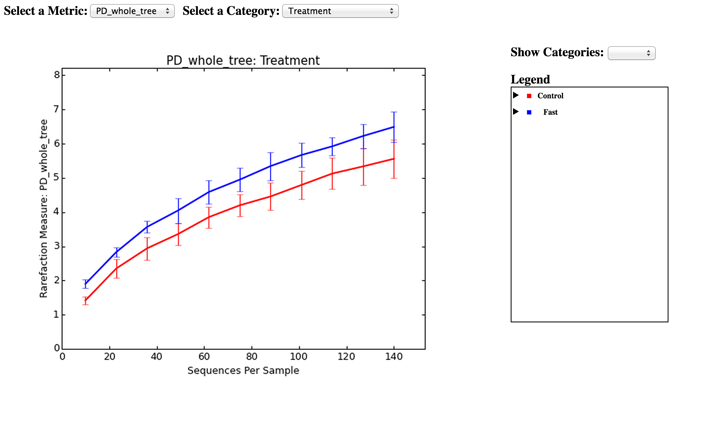

.. _tutorial:

================================================================================
454 Overview Tutorial: de novo OTU picking and diversity analyses using 454 data
================================================================================
This tutorial explains how to apply de novo OTU picking and diversity analyses to 16S amplicon data using QIIME. We recommend first working through the `QIIME Illumina Overview Tutorial <./illumina_overview_tutorial.html>`_, which covers many of these analysis steps at a higher level. This tutorial provides additional detail on the steps that are being performed by the QIIME workflows.

As an example, we will use data from a study of the response of mouse gut microbial communities to fasting (`Crawford et al. (2009) <http://www.ncbi.nlm.nih.gov/pubmed/19549860>`_). To make this tutorial run quickly on a personal computer, we will use a subset of the data generated from 5 animals kept on the control *ad libitum* fed diet, and 4 animals fasted for 24 hours before sacrifice. At the end of our tutorial, we will be able to compare the community structure of control vs. fasted animals. In particular, we will be able to compare taxonomic profiles for each sample type and perform alpha and beta diversity analyses to look for community-level differences in the samples.

If you need help while working through the tutorial, please visit http://help.qiime.org.

Obtaining the data
------------------
All the files you will need for this tutorial can be downloaded `here <ftp://ftp.microbio.me/pub/qiime-files/qiime_overview_tutorial.zip>`_. Descriptions of these files are below.

Open a terminal and use the ``cd`` command to move to the directory where you downloaded the tutorial data. Next, unzip the tutorial data and move into the unzipped directory that is created::

    unzip qiime_overview_tutorial.zip
    cd qiime_overview_tutorial

Sequences (.fna)
^^^^^^^^^^^^^^^^
This is the 454-machine generated FASTA file. Using the Amplicon processing software on the 454 FLX standard, each region of the PTP plate will yield a fasta file of form :file:`1.TCA.454Reads.fna`, where "1" is replaced with the appropriate region number. For the purposes of this tutorial, we will use the fasta file :file:`Fasting_Example.fna`.

Quality Scores (.qual)
^^^^^^^^^^^^^^^^^^^^^^
This is the 454-machine generated quality score file, which contains a score for each base in each sequence included in the FASTA file. Like the fasta file mentioned above, the Amplicon processing software will generate one of these files for each region of the PTP plate, named :file:`1.TCA.454Reads.qual`, etc. For the purposes of this tutorial, we will use the quality scores file :file:`Fasting_Example.qual`.

Mapping File (Tab-delimited .txt)
^^^^^^^^^^^^^^^^^^^^^^^^^^^^^^^^^
The mapping file is generated by the user. This file contains all of the information about the samples necessary to perform the data analysis. See `here <http://qiime.org/documentation/file_formats.html#metadata-mapping-files>`_ for more details about the mapping file format.

For the purposes of this tutorial, we will use the mapping file :file:`Fasting_Map.txt`. The contents of the mapping file are shown here - as you can see, a nucleotide barcode sequence is provided for each of the 9 samples, as well as metadata related to treatment group and date of birth, and general run descriptions about the project::

   #SampleID  BarcodeSequence LinkerPrimerSequence    Treatment DOB   Description
   #Example mapping file for the QIIME analysis package. These 9 samples are from a study of the effects of
   #exercise and diet on mouse cardiac physiology (Crawford, et al, PNAS, 2009).
   PC.354 AGCACGAGCCTA    YATGCTGCCTCCCGTAGGAGT   Control 20061218    Control_mouse__I.D._354
   PC.355 AACTCGTCGATG    YATGCTGCCTCCCGTAGGAGT   Control 20061218    Control_mouse__I.D._355
   PC.356 ACAGACCACTCA    YATGCTGCCTCCCGTAGGAGT   Control 20061126    Control_mouse__I.D._356
   PC.481 ACCAGCGACTAG    YATGCTGCCTCCCGTAGGAGT   Control 20070314    Control_mouse__I.D._481
   PC.593 AGCAGCACTTGT    YATGCTGCCTCCCGTAGGAGT   Control 20071210    Control_mouse__I.D._593
   PC.607 AACTGTGCGTAC    YATGCTGCCTCCCGTAGGAGT   Fast    20071112    Fasting_mouse__I.D._607
   PC.634 ACAGAGTCGGCT    YATGCTGCCTCCCGTAGGAGT   Fast    20080116    Fasting_mouse__I.D._634
   PC.635 ACCGCAGAGTCA    YATGCTGCCTCCCGTAGGAGT   Fast    20080116    Fasting_mouse__I.D._635
   PC.636 ACGGTGAGTGTC    YATGCTGCCTCCCGTAGGAGT   Fast    20080116    Fasting_mouse__I.D._636

.. _checkmapping:

Validate the mapping file
-------------------------
First, you should ensure that your mapping file is formatted correctly with the `validate_mapping_file.py <../scripts/validate_mapping_file.html>`_ script::

    validate_mapping_file.py -m Fasting_Map.txt -o mapping_output

This script will print a message indicating whether or not problems were found in the mapping file. An HTML file showing the location of errors and warnings will be generated in the output directory, and a plain text log file will also be created. Errors will cause fatal problems with subsequent scripts and must be corrected before moving forward. Warnings will not cause fatal problems, but it is encouraged that you fix these problems as they are often indicative of typos in your mapping file, invalid characters, or other unintended errors that will impact downstream analysis. A file ending with :file:`_corrected.txt` will also be created in the output directory, which will have a copy of the mapping file with invalid characters replaced by underscores.

Reverse primers can be specified in the mapping file, for removal during the demultiplexing step.  This is not required, but it is **strongly** recommended, as leaving in sequences following primers, such as sequencing adapters, can interfere with OTU picking and taxonomic assignment.

For example, a mapping file with reverse primers specified in the ``ReversePrimer`` column might look like::

   #SampleID  BarcodeSequence LinkerPrimerSequence    Treatment ReversePrimer   Description
   #Example mapping file for the QIIME analysis package. These 9 samples are from a study of the effects of
   #exercise and diet on mouse cardiac physiology (Crawford, et al, PNAS, 2009).
   PC.354 AGCACGAGCCTA    YATGCTGCCTCCCGTAGGAGT   Control GCGCACGGGTGAGTA    Control_mouse__I.D._354
   PC.355 AACTCGTCGATG    YATGCTGCCTCCCGTAGGAGT   Control GCGCACGGGTGAGTA    Control_mouse__I.D._355
   PC.356 ACAGACCACTCA    YATGCTGCCTCCCGTAGGAGT   Control GCGCACGGGTGAGTA    Control_mouse__I.D._356
   PC.481 ACCAGCGACTAG    YATGCTGCCTCCCGTAGGAGT   Control GCGCACGGGTGAGTA    Control_mouse__I.D._481
   PC.593 AGCAGCACTTGT    YATGCTGCCTCCCGTAGGAGT   Control GCGCACGGGTGAGTA    Control_mouse__I.D._593
   PC.607 AACTGTGCGTAC    YATGCTGCCTCCCGTAGGAGT   Fast    GCGCACGGGTGAGTA    Fasting_mouse__I.D._607
   PC.634 ACAGAGTCGGCT    YATGCTGCCTCCCGTAGGAGT   Fast    GCGCACGGGTGAGTA    Fasting_mouse__I.D._634
   PC.635 ACCGCAGAGTCA    YATGCTGCCTCCCGTAGGAGT   Fast    GCGCACGGGTGAGTA    Fasting_mouse__I.D._635
   PC.636 ACGGTGAGTGTC    YATGCTGCCTCCCGTAGGAGT   Fast    GCGCACGGGTGAGTA    Fasting_mouse__I.D._636

The reverse primers, like the forward primers, are written in 5'->3' direction.  In this case, these are not the true reverse primers used, but rather just a somewhat conserved site in the sequences used for this example.

The primer construct and amplicon used in `Crawford et al. (2009) <http://www.ncbi.nlm.nih.gov/pubmed/19549860>`_ is shown below, annotated using QIIME nomenclature:

.. image:: ../images/ example_primer_construct.png
   :align: center

454 sequencing, in most cases, generates sequences that begin at the ``BarcodeSequence``, which is followed by the ``LinkerPrimerSequence``, both of which are automatically removed during the demultiplexing step described below.  The ``ReversePrimer`` (i.e., the primer at the end of the read) is not removed by default but can be using the ``-z`` option to `split_libraries.py <../scripts/split_libraries.html>`_. The adapter sequence (Adapter B) is not a biological sequence, so must be removed if you suspect that it is contained within your reads. This can be achieved using the ``-z`` option to `split_libraries.py <../scripts/split_libraries.html>`_.

.. _assignsamples:

Demultiplex and quality filter reads
------------------------------------
The next task is to assign the multiplexed reads to samples based on their nucleotide barcode (this is known as *demultiplexing*). This step also performs quality filtering based on the characteristics of each sequence, removing any low quality or ambiguous reads. To perform these steps we'll use `split_libraries.py <../scripts/split_libraries.html>`_::

    split_libraries.py -m Fasting_Map.txt -f Fasting_Example.fna -q Fasting_Example.qual -o split_library_output

This will create three files in the new directory :file:`split_library_output/`:

* :file:`split_library_log.txt` : This file contains the summary of demultiplexing and quality filtering, including the number of reads detected for each sample and a brief summary of any reads that were removed due to quality considerations.
* :file:`histograms.txt` : This tab-delimited file shows the number of reads at regular size intervals before and after splitting the library.
* :file:`seqs.fna` : This is a fasta formatted file where each sequence is renamed according to the sample it came from. The header line also contains the name of the read in the input fasta file and information on any barcode errors that were corrected.

A few lines from the :file:`seqs.fna` file are shown below::

   >PC.634_1 FLP3FBN01ELBSX orig_bc=ACAGAGTCGGCT new_bc=ACAGAGTCGGCT bc_diffs=0
   CTGGGCCGTGTCTCAGTCCCAATGTGGCCGTTTACCCTCTCAGGCCGGCTACGCATCATCGCC....
   >PC.634_2 FLP3FBN01EG8AX orig_bc=ACAGAGTCGGCT new_bc=ACAGAGTCGGCT bc_diffs=0
   TTGGACCGTGTCTCAGTTCCAATGTGGGGGCCTTCCTCTCAGAACCCCTATCCATCGAAGGCTT....
   >PC.354_3 FLP3FBN01EEWKD orig_bc=AGCACGAGCCTA new_bc=AGCACGAGCCTA bc_diffs=0
   TTGGGCCGTGTCTCAGTCCCAATGTGGCCGATCAGTCTCTTAACTCGGCTATGCATCATTGCCTT....
   >PC.481_4 FLP3FBN01DEHK3 orig_bc=ACCAGCGACTAG new_bc=ACCAGCGACTAG bc_diffs=0
   CTGGGCCGTGTCTCAGTCCCAATGTGGCCGTTCAACCTCTCAGTCCGGCTACTGATCGTCGACT....

The first several lines of the :file:`split_library_log.txt` file are shown below::

   Number raw input seqs   1339

   Length outside bounds of 200 and 1000   0
   Num ambiguous bases exceeds limit of 6  0
   Missing Qual Score      0
   Mean qual score below minimum of 25     1
   Max homopolymer run exceeds limit of 6  0
   Num mismatches in primer exceeds limit of 0: 1
   ...

Reverse primer removal can be accomplished by adding the ``-z`` option.  An example command using the mapping file with reverse primers described above::

    split_libraries.py -m Fasting_Map_reverse_primers.txt -f Fasting_Example.fna -q Fasting_Example.qual -z truncate_only -o split_library_output_revprimers

If the number of sequences where the reverse primer is not identifiable is high, you should check the primer sequence to make sure it is in 5'->3' orientation, or increase the number of mismatches allowed with ``--reverse_primer_mismatches``.

Data that are already demultiplexed can have reverse primers removed using the standalone script `truncate_reverse_primer.py <../scripts/truncate_reverse_primer.html>`_.

.. _pickotusandrepseqs:

De novo OTU picking
-------------------
Here we will be running the `pick_de_novo_otus.py <../scripts/pick_de_novo_otus.html>`_ workflow, which runs a series of other scripts automatically. This workflow consists of the following steps:

1. Pick OTUs based on sequence similarity within the reads (`pick_otus.py <../scripts/pick_otus.html>`_)
2. Pick a representative sequence for each OTU (`pick_rep_set.py <../scripts/pick_rep_set.html>`_)
3. Assign taxonomy to OTU representative sequences (`assign_taxonomy.py <../scripts/assign_taxonomy.html>`_)
4. Align OTU representative sequences (`align_seqs.py <../scripts/align_seqs.html>`_)
5. Filter the alignment (`filter_alignment.py <../scripts/filter_alignment.html>`_)
6. Build a phylogenetic tree  (`make_phylogeny.py <../scripts/make_phylogeny.html>`_)
7. Make the OTU table (`make_otu_table.py <../scripts/make_otu_table.html>`_)

Using the output from `split_libraries.py <../scripts/split_libraries.html>`_ (:file:`seqs.fna`), run the following command::

    pick_de_novo_otus.py -i split_library_output/seqs.fna -o otus

If you're interested in denoising 454 data, refer to the `denoising tutorial <./denoising_454_data.html>`_.

The results of `pick_de_novo_otus.py <../scripts/pick_de_novo_otus.html>`_ are in :file:`otus/`, and a description of the steps performed and the results follow:

.. _pickotusseqsim:

Step 1. Pick OTUs based on sequence similarity within the reads
^^^^^^^^^^^^^^^^^^^^^^^^^^^^^^^^^^^^^^^^^^^^^^^^^^^^^^^^^^^^^^^
At this step, all of the sequences from all of the samples will be clustered into Operational Taxonomic Units (OTUs) based on their sequence similarity. OTUs in QIIME are clusters of sequences, frequently intended to represent some degree of taxonomic relatedness. For example, when sequences are clustered at 97% sequence similarity, each resulting cluster is typically thought of as representing a species. This model and the current techniques for picking OTUs are known to be flawed, however, in that 97% OTUs do not match what humans have called species for many microbes. Determining exactly how OTUs should be defined, and what they represent, is an active area of research. See `here <otu_picking.html>`_ for more information about OTU picking with QIIME.

.. _pickrepseqsforotu:

Step 2. Pick a representative sequence for each OTU
^^^^^^^^^^^^^^^^^^^^^^^^^^^^^^^^^^^^^^^^^^^^^^^^^^^
Since each OTU may be made up of many related sequences, we will pick a representative sequence from each OTU for downstream analysis. This representative sequence will be used for taxonomic identification of the OTU and phylogenetic alignment. QIIME uses the OTU file created above and extracts a representative sequence from the fasta file by one of several methods.

In the :file:`otus/rep_set/` directory, QIIME has a fasta file :file:`seqs_rep_set.fasta` containing one representative sequence for each OTU. In this fasta file, the sequence has been renamed with the OTU identifier, and the additional information on the header line reflects the sequence used as the representative::

   >0 PC.636_424
   CTGGGCCGTATCTCAGTCCCAATGTGGCCGGTCGACCTCTC....
   >1 PC.481_321
   TTGGGCCGTGTCTCAGTCCCAATGTGGCCGTCCGCCCTCTC....

.. _assigntax:

Step 3. Assign taxonomy to OTU representative sequences
^^^^^^^^^^^^^^^^^^^^^^^^^^^^^^^^^^^^^^^^^^^^^^^^^^^^^^^
Next, taxonomy will be assigned to each representative sequence. By default, QIIME uses the uclust consensus taxonomy classifier to attempt to assign taxonomy to each representative sequence resulting from step 2.

In the directory :file:`otus/uclust_assigned_taxonomy/`, there will be a log file and a text file. The text file (which we refer to as an observation or OTU metadata file) contains a line for each OTU, followed by the taxonomic assignment, the fraction of uclust hits that contained this taxonomic assignment, and the number of uclust hits that were found. For some OTUs, the assignment may be as specific as a bacterial species, while others may not be assignable at all (and will therefore be labeled as *Unassigned*). Below are the first few lines of an observation metadata file containing the results of uclust taxonomic assignment::

	denovo367	k__Bacteria; p__Bacteroidetes; c__Bacteroidia; o__Bacteroidales; f__S24-7; g__; s__	1.00	3
	denovo366	k__Bacteria; p__Firmicutes; c__Clostridia; o__Clostridiales; f__; g__; s__	1.00	3
	denovo365	k__Bacteria; p__Firmicutes; c__Erysipelotrichi; o__Erysipelotrichales; f__Erysipelotrichaceae; g__Allobaculum; s__	1.00	3
	denovo364	k__Bacteria; p__Firmicutes; c__Clostridia; o__Clostridiales; f__Lachnospiraceae	0.67	3
	denovo281	Unassigned	1.00	1

.. _alignotuseq:

Step 4. Align OTU representative sequences
^^^^^^^^^^^^^^^^^^^^^^^^^^^^^^^^^^^^^^^^^^
Alignment of the OTU representative sequences and phylogeny inference is necessary only if phylogenetic metrics such as UniFrac_ will be subsequently invoked. Alignments can either be generated de novo using programs such as MUSCLE, or through alignment to an existing alignment with tools like PyNAST_. For small studies such as this tutorial, either method is possible. However, for studies involving many sequences (roughly, more than 1000), de novo aligners are very slow and alignment with PyNAST_ is necessary. Since alignment is one of the most computationally intensive bottlenecks in the pipeline, large studies benefit greatly from parallelization of this task, which is possible with PyNAST_.

After aligning the sequences, a log file and an alignment file are created in the directory :file:`otus/pynast_aligned_seqs/`.

.. _filteraln:

Step 5. Filter the alignment
^^^^^^^^^^^^^^^^^^^^^^^^^^^^
Before inferring a phylogenetic tree relating the sequences, it is beneficial to filter the sequence alignment to remove columns comprised of only gaps, and locations known to be excessively variable. QIIME uses a 16S alignment Lane mask (Lane, D.J. 1991) by default. After filtering, a filtered alignment file is created in the directory :file:`otus/pynast_aligned_seqs/`.

.. _maketree:

Step 6. Build a phylogenetic tree
^^^^^^^^^^^^^^^^^^^^^^^^^^^^^^^^^
The filtered alignment file produced in the directory :file:`otus/pynast_aligned_seqs/` is then used to build a phylogenetic tree using a tree-building program.

The Newick format tree file is written to :file:`rep_set.tre`, which is located in the :file:`otus/` directory . This file can be viewed in tree visualization software, and is necessary for UniFrac_ diversity measurements and other phylogenetically-aware analyses (described below). The tree obtained can be visualized with programs such as `FigTree <http://tree.bio.ed.ac.uk/software/figtree/>`_, which was used to visualize the phylogenetic tree stored in :file:`rep_set.tre`:

.. image:: ../images/ tree.png
   :align: center

.. _makeotutable:

Step 7. Make the OTU table
^^^^^^^^^^^^^^^^^^^^^^^^^^
Using taxonomic assignments (step 3) and the OTU map (step 1) QIIME assembles a table of OTU abundances in each sample with taxonomic identifiers for each OTU.

The result of this step is :file:`otu_table.biom`, which is located in the :file:`otus/` directory. For more information about the OTU table format, which is stored in the BIOM format, please see `here <http://biom-format.org>`_.

.. _perlibrarystats:

Summarize the OTU table
-----------------------
To view summary statistics of the OTU table, run::

    biom summarize-table -i otus/otu_table.biom

The summary shows that there are relatively few sequences in this tutorial example, but the sequences present are fairly evenly distributed among the 9 microbial communities::

    Num samples: 9
    Num observations: 419
    Total count: 1337
    Table density (fraction of non-zero values): 0.168

    Counts/sample summary:
     Min: 146.0
     Max: 150.0
     Median: 149.000
     Mean: 148.556
     Std. dev.: 1.257
     Sample Metadata Categories:
     Observation Metadata Categories: taxonomy

    Counts/sample detail:
     PC.481: 146.0
     PC.355: 147.0
     PC.636: 148.0
     PC.607: 149.0
     PC.635: 149.0
     PC.593: 149.0
     PC.354: 149.0
     PC.634: 150.0
     PC.356: 150.0

.. _makeotunetwork:

Make an OTU network
-------------------
To create an OTU network, using the following command::

    make_otu_network.py -m Fasting_Map.txt -i otus/otu_table.biom -o otus

To visualize the network, we use the Cytoscape_ program (which you can run by calling cytoscape from the command line -- you may need to call this beginning either with a capital or lowercase 'C' depending on your version of Cytoscape_), where each red circle represents a sample and each white square represents an OTU. The lines represent the OTUs present in a particular sample (blue for controls and green for fasting). For more information about opening the files in Cytoscape_ please refer to `Making Cytoscape Networks <./making_cytoscape_networks.html>`_.

.. image:: ../images/ network.png
   :align: center

.. _summarizetaxa:

Summarize communities by taxonomic composition
----------------------------------------------
You can group OTUs by different taxonomic levels (phylum, class, family, etc.) with the workflow script `summarize_taxa_through_plots.py <../scripts/summarize_taxa_through_plots.html>`_. Note that this process depends directly on the method used to assign taxonomic information to OTUS (see `Assigning Taxonomy`__ above):

__ assigntax_

::

    summarize_taxa_through_plots.py -i otus/otu_table.biom -o taxa_summary -m Fasting_Map.txt

The script will generate new tables at various taxonomic levels (we'll refer to these as *taxonomy tables*, which are different than *OTU tables*). For example, the class-level table is located at :file:`taxa_summary/otu_table_L3.txt`. Each taxonomy table contains the relative abundances of taxa within each sample::

    #OTU ID	PC.636	PC.635 PC.356	PC.481	PC.354 PC.593	PC.355	PC.607 PC.634
    Unassigned;Other;Other 0.027027027027 0.00671140939597 0.0133333333333 0.00684931506849	0.0 0.00671140939597 0.00680272108844 0.0134228187919	0.02
    k__Bacteria;Other;Other	0.0 0.0	0.0	0.0	0.0	0.0	0.0 0.00671140939597	0.0
    k__Bacteria;p__Actinobacteria;c__Coriobacteriia 0.00675675675676	0.0	0.0 0.00684931506849	0.0	0.0	0.0 0.0134228187919 0.0133333333333
    k__Bacteria;p__Bacteroidetes;c__Bacteroidia 0.675675675676 0.530201342282	0.2 0.143835616438 0.0805369127517 0.389261744966 0.285714285714 0.288590604027	0.64
    k__Bacteria;p__Deferribacteres;c__Deferribacteres 0.0472972972973 0.0134228187919	0.0	0.0	0.0 0.0	0.0	0.0201342281879 0.0333333333333
    k__Bacteria;p__Firmicutes;c__Bacilli	0.027027027027	0.0 0.0933333333333 0.089041095890 0.107382550336 0.0335570469799 0.0136054421769 0.00671140939597	0.02
    k__Bacteria;p__Firmicutes;c__Clostridia	0.195945945946 0.436241610738 0.686666666667 0.712328767123 0.798657718121 0.389261744966 0.69387755102 0.469798657718 0.213333333333
    k__Bacteria;p__Firmicutes;c__Erysipelotrichi 0.0135135135135 0.00671140939597	0.0 0.0342465753425 0.0134228187919 0.147651006711	0.0 0.154362416107 0.0266666666667

.. _maketaxacharts:

To view the resulting charts, open the area or bar chart html file located in the :file:`taxa_summary/taxa_summary_plots` folder. The following chart shows the taxonomic assignments for each sample as a bar chart. You can mouse-over the plot to see which taxa are contributing to the percentage shown:

.. image:: ../images/ barchart1.png
   :align: center

.. _makeheatmap:

Make a taxonomy heatmap
-----------------------
QIIME supports generating heatmap images of BIOM tables (e.g., OTU tables or the taxonomy tables generated in the previous step) with `make_otu_heatmap.py <../scripts/make_otu_heatmap.html>`_. Let's create a heatmap illustrating class-level abundances on a per-sample basis, where samples are sorted by whether they are from control or fasted mice::

    make_otu_heatmap.py -i taxa_summary/otu_table_L3.biom -o taxa_summary/otu_table_L3_heatmap.pdf -c Treatment -m Fasting_Map.txt

A PDF file is created as :file:`taxa_summary/otu_table_L3_heatmap.pdf`. The first four samples are from fasted mice and the last five are from controls. This clearly illustrates class-level differences in the taxonomic composition of the samples:

.. image:: ../images/ heatmap.png
   :align: center

.. _compalphadivrarecurves:

Compute alpha diversity and generate alpha rarefaction plots
------------------------------------------------------------
Community ecologists are often interested in computing *alpha* (or the *within-sample*) diversity for samples or groups of samples in their study. Here, we will determine the level of alpha diversity in our samples using QIIME's `alpha_rarefaction.py <../scripts/alpha_rarefaction.html>`_ workflow, which performs the following steps:

1. Generate rarefied OTU tables (`multiple_rarefactions.py <../scripts/multiple_rarefactions.html>`_)
2. Compute measures of alpha diversity for each rarefied OTU table (`alpha_diversity.py <../scripts/alpha_diversity.html>`_)
3. Collate alpha diversity results (`collate_alpha.py <../scripts/collate_alpha.html>`_)
4. Generate alpha rarefaction plots (`make_rarefaction_plots.py <../scripts/make_rarefaction_plots.html>`_)

Although we could run this workflow with the (sensible) default parameters, this provides an opportunity to illustrate the use of custom parameters in a QIIME workflow. To see what measures of alpha diversity will be computed by default, run::

    alpha_diversity.py -h

You should see, among other information::

    -m METRICS, --metrics=METRICS
        Alpha-diversity metric(s) to use. A comma-separated
        list should be provided when multiple metrics are
        specified. [default: PD_whole_tree,chao1,observed_otus]

which indicates that the metrics that will be used by default are ``PD_whole_tree``, ``chao1``, and ``observed_otus``. If we additionally wanted to compute Shannon Index, we could create a parameters file (which for the sake of this example we'll call :file:`alpha_params.txt`) containing the following line::

    alpha_diversity:metrics shannon,PD_whole_tree,chao1,observed_otus

For more information on creating parameters files, see `here <../documentation/qiime_parameters_files.html>`_.

We can next run `alpha_rarefaction.py <../scripts/alpha_rarefaction.html>`_, which requires the OTU table (``-i``) and phylogenetic tree (``-t``) from `above`__, and the parameters file we just created:

__ pickotusandrepseqs_

::

    alpha_rarefaction.py -i otus/otu_table.biom -m Fasting_Map.txt -o arare -p alpha_params.txt -t otus/rep_set.tre

Descriptions of the steps involved in `alpha_rarefaction.py <../scripts/alpha_rarefaction.html>`_ follow:

.. _rareotutable:

Step 1. Generate rarefied OTU tables
^^^^^^^^^^^^^^^^^^^^^^^^^^^^^^^^^^^^
The directory :file:`arare/rarefaction/` will contain many text files named :file:`rarefaction_##_#.txt`; the first set of numbers represents the number of sequences sampled, and the last number represents the iteration number. If you opened one of these files, you would find an OTU table where for each sample the sum of the counts equals the number of samples taken.

To keep the results of `alpha_rarefaction.py <../scripts/alpha_rarefaction.html>`_ to a manageable size, these results are deleted unless you pass the ``--retain_intermediate_files`` option to `alpha_rarefaction.py <../scripts/alpha_rarefaction.html>`_.

.. _computealphadiv:

Step 2. Compute measures of alpha diversity for each rarefied OTU table
^^^^^^^^^^^^^^^^^^^^^^^^^^^^^^^^^^^^^^^^^^^^^^^^^^^^^^^^^^^^^^^^^^^^^^^
The rarefied tables are the basis for calculating alpha diversity metrics, which describe the richness and/or evenness of taxa in a single sample. QIIME allows users to calculate more than two dozen different diversity metrics. The full list of available metrics is available `here <http://scikit-bio.org/docs/latest/generated/skbio.diversity.alpha.html>`_. Each metric has different strengths and limitations. Technical discussion of each metric is readily available online and in ecology textbooks, but it is beyond the scope of this tutorial. By default, QIIME calculates three metrics: Chao1 (``chao1``), Observed OTUs (``observed_otus``, previously known as Observed Species), and Phylogenetic Diversity (``PD_whole_tree``). In addition, in the :file:`alpha_params.txt` file we added the Shannon Index (``shannon``) to the list of alpha diversity measures that we calculated here.

The result of this step produces text files with the results of the alpha diversity computations performed on the rarefied OTU tables. The results are located in the :file:`arare/alpha_div/` directory.

To keep the results of `alpha_rarefaction.py <../scripts/alpha_rarefaction.html>`_ to a manageable size, these results are deleted unless you pass the ``--retain_intermediate_files`` option to `alpha_rarefaction.py <../scripts/alpha_rarefaction.html>`_.

.. _collateotutable:

Step 3. Collate alpha diversity results
^^^^^^^^^^^^^^^^^^^^^^^^^^^^^^^^^^^^^^^
The output directory :file:`arare/alpha_div/` will contain one text file :file:`alpha_rarefaction_##_#` for every file input from :file:`arare/rarefaction/`, where the numbers represent the number of samples and iterations as before. The content of this tab delimited file is the calculated metrics for each sample. To collapse the individual files into a single combined table, the workflow uses `collate_alpha.py <../scripts/collate_alpha.html>`_.

In the output directory :file:`arare/alpha_div_collated/`, there will be one file for every alpha diversity metric used. Each file will contain the alpha diversity measure for every sample, arranged in ascending order from lowest number of sequences per sample to highest. A portion of the :file:`observed_otus.txt` file are shown below::

        sequences per sample	iteration	PC.636	PC.635	PC.356	PC.481	PC.354	PC.593	PC.355	PC.607	PC.634
    alpha_rarefaction_10_0.txt	10	0	7.0	10.0	6.0	8.0	9.0	9.0	7.0	9.0	10.0
    alpha_rarefaction_10_1.txt	10	1	8.0	9.0	10.0	8.0	9.0	6.0	8.0	10.0	9.0
    alpha_rarefaction_10_2.txt	10	2	8.0	10.0	9.0	10.0	8.0	8.0	9.0	10.0	7.0
    alpha_rarefaction_10_3.txt	10	3	8.0	9.0	7.0	10.0	6.0	9.0	7.0	10.0	7.0
    alpha_rarefaction_10_4.txt	10	4	8.0	9.0	8.0	7.0	8.0	10.0	9.0	9.0	9.0

.. _generaterarecurves:

Step 4. Generate alpha rarefaction plots
^^^^^^^^^^^^^^^^^^^^^^^^^^^^^^^^^^^^^^^^
QIIME creates plots of alpha diversity vs. simulated sequencing effort, known as rarefaction plots, using the script `make_rarefaction_plots.py <../scripts/make_rarefaction_plots.html>`_. This script takes a mapping file and any number of files generated by `collate_alpha.py <../scripts/collate_alpha.html>`_, and creates alpha rarefaction curves. Each curve represents a sample and can be grouped by the sample metadata supplied in the mapping file.

This step generates a :file:`arare/alpha_rarefaction_plots/rarefaction_plots.html` file that can be opened with a web browser, in addition to other files. The :file:`arare/alpha_rarefaction_plots/average_plots/` folder contains the average plots for each metric and category.

The :file:`arare/alpha_rarefaction_plots/average_tables/` folder contains the diversity measure averages for each rarefied table, so the user can optionally plot the rarefaction curves in another application. To keep the results of `make_rarefaction_plots.py <../scripts/make_rarefaction_plots.html>`_ to a manageable size, these results are not generated unless you pass the ``--generate_average_tables`` option to `make_rarefaction_plots.py <../scripts/make_rarefaction_plots.html>`_.

Viewing alpha rarefaction plots
^^^^^^^^^^^^^^^^^^^^^^^^^^^^^^^
To view the alpha rarefaction plots, open the file :file:`arare/alpha_rarefaction_plots/rarefaction_plots.html`. Once the browser window is open,  select the metric `PD_whole_tree` and the category `Treatment`, to reveal a plot like the figure below. You can click on the triangle next to each label in the legend to see all the samples that contribute to that category. Below each plot is a table displaying average values for each measure of alpha diversity for each group of samples in the specified category.

.. _compbetadivgenpcoa:

Compute beta diversity and generate ordination plots
----------------------------------------------------
In addition to *alpha* (or *within-sample*) diversity, community ecologists are often interested in computing *beta* (or the *between-sample*) diversity between all pairs of samples in their study.

Beta diversity represents the explicit comparison of microbial (or other) communities based on their composition. Beta diversity metrics thus assess the differences between microbial communities. The fundamental output of these comparisons is a square, hollow matrix where a "distance" or dissimilarity is calculated between every pair of community samples, reflecting the dissimilarity between those samples. The data in this distance matrix can be visualized with analyses such as Principal Coordinates Analysis (PCoA) and hierarchical clustering.

Like alpha diversity, there are many possible beta diversity metrics that can be calculated with QIIME. The full list of metrics can be viewed by running::

    beta_diversity.py -s

Here, we will calculate beta diversity between our 9 microbial communities using the default beta diversity metrics of weighted and unweighted UniFrac_, which are phylogenetic measures used extensively in recent microbial community sequencing projects. To perform this analysis, we will use the `beta_diversity_through_plots.py <../scripts/beta_diversity_through_plots.html>`_ workflow, which performs the following steps:

1. Rarefy OTU table to remove sample heterogeneity (`single_rarefaction.py <../scripts/single_rarefaction.html>`_)
2. Compute beta diversity (`beta_diversity.py <../scripts/beta_diversity.html>`_)
3. Run Principal Coordinates Analysis (`principal_coordinates.py <../scripts/principal_coordinates.html>`_)
4. Generate Emperor PCoA plots (`make_emperor.py <http://emperor.colorado.edu/>`_)

We can run the `beta_diversity_through_plots.py <../scripts/beta_diversity_through_plots.html>`_ workflow with the following command, which requires the OTU table (``-i``) and tree file (``-t``) from `above`__, the metadata mapping file (``-m``), and the number of sequences per sample (``-e``, even sampling depth):

__ pickotusandrepseqs_

::

    beta_diversity_through_plots.py -i otus/otu_table.biom -m Fasting_Map.txt -o bdiv_even146 -t otus/rep_set.tre -e 146

Descriptions of the steps involved in `beta_diversity_through_plots.py <../scripts/beta_diversity_through_plots.html>`_ follow:

.. _compbetadiv:

Step 1. Rarefy OTU table to remove sample heterogeneity
^^^^^^^^^^^^^^^^^^^^^^^^^^^^^^^^^^^^^^^^^^^^^^^^^^^^^^^
To remove sample heterogeneity, we can perform rarefaction on our OTU table. Rarefaction is an ecological approach that allows users to standardize the data obtained from samples with different sequencing efforts, and to compare the OTU richness of the samples using these standardized data. For instance, if one of your samples yielded 10,000 sequences, and another yielded only 1,000 sequences, the species diversity within those samples may be much more influenced by sequencing effort than the underlying biology. We use rarefaction to randomly subsample the same number of sequences from each sample in order to compare the communities at a given level of sampling effort (an *even sampling depth*).

See the ``biom summarize-table`` section `above`__ for the number of sequences in each of the 9 communities.

__ perlibrarystats_

Since all samples have at least 146 sequences, a rarefaction level of 146 (specified by ``-e 146`` above) allows us to compare all 9 samples at equal sequencing depth. Any samples containing fewer than 146 sequences would have been removed from these beta diversity analyses.

Step 2. Compute beta diversity
^^^^^^^^^^^^^^^^^^^^^^^^^^^^^^
Beta diversity metrics assess the differences between microbial communities. By default, QIIME calculates both weighted and unweighted UniFrac_, which are phylogenetically-aware measures of beta diversity.

The resulting distance matrices (:file:`bdiv_even146/unweighted_unifrac_dm.txt` and :file:`bdiv_even146/weighted_unifrac_dm.txt`) are the basis for further analyses and visualizations (e.g., Principal Coordinates Analysis and hierarchical clustering).

Step 3. Run Principal Coordinates Analysis
^^^^^^^^^^^^^^^^^^^^^^^^^^^^^^^^^^^^^^^^^^
Principal Coordinates Analysis (PCoA) is a technique that helps to extract and visualize a few highly-informative components of variation from complex, multidimensional data. This is a transformation that maps the samples present in the distance matrix to a new set of orthogonal axes such that a maximum amount of variation is explained by the first principal coordinate, the second largest amount of variation is explained by the second principal coordinate, etc. The principal coordinates can be plotted in two or three dimensions to provide an intuitive visualization of differences between samples.

The files :file:`bdiv_even146/unweighted_unifrac_pc.txt` and :file:`bdiv_even146/weighted_unifrac_pc.txt` contain the results of PCoA applied to the unweighed and weighted UniFrac_ distance matrices, respectively.

Step 4. Generate Emperor PCoA plots
^^^^^^^^^^^^^^^^^^^^^^^^^^^^^^^^^^^
`Emperor <http://emperor.colorado.edu/>`_ allows for the visualization of PCoA plots in three dimensions. HTML files are created in :file:`bdiv_even146/unweighted_unifrac_emperor_pcoa_plot` and :file:`bdiv_even146/weighted_unifrac_emperor_pcoa_plot` directories. For the ``Treatment`` column in the mapping file, all samples with the same treatment (control or fasted) will get the same color. By default, the five control samples are colored red and the four fasted samples are colored blue (colors, and many other plot settings, can be customized in Emperor). This allows you to easily visualize "clustering" by metadata category. The 3-D visualization software allows you to rotate the axes to see the data from different perspectives. By default, Emperor will plot the first three principal coordinates. Other combinations can be viewed using the "Axes" option in Emperor. The first 8 components can be viewed using the left bottom menu "Parallel" using a parallel coordinates plot.

.. image:: ../images/ pcoa1.png
   :align: center
   :width: 900px

.. _gendisthist:

.. _jackbd:

Jackknifed beta diversity and hierarchical clustering
-----------------------------------------------------
The `jackknifed_beta_diversity.py <../scripts/jackknifed_beta_diversity.html>`_ workflow uses jackknife replicates to estimate the uncertainty in PCoA plots and hierarchical clustering of microbial communities. Many of the same concepts relevant to beta diversity and PCoA are used here. `jackknifed_beta_diversity.py <../scripts/jackknifed_beta_diversity.html>`_ performs the following steps:

1. Compute beta diversity distance matrix from full OTU table and tree, if applicable (`beta_diversity.py <../scripts/beta_diversity.html>`_)
2. Build UPGMA tree from full distance matrix (`upgma_cluster.py <../scripts/upgma_cluster.html>`_)
3. Build rarefied OTU tables (`multiple_rarefactions_even_depth.py <../scripts/multiple_rarefactions_even_depth.html>`_)
4. Compute distance matrices from rarefied OTU tables (`beta_diversity.py <../scripts/beta_diversity.html>`_) <../scripts/beta_diversity.html>`_)
5. Build UPGMA trees from rarefied distance matrices (`upgma_cluster.py <../scripts/upgma_cluster.html>`_)
6. Compare rarefied UPGMA trees and determine jackknife support for tree nodes (`tree_compare.py <../scripts/tree_compare.html>`_ and `consensus_tree.py <../scripts/consensus_tree.html>`_)
7. Compute PCoA on each rarefied distance matrix (`principal_coordinates.py <../scripts/principal_coordinates.html>`_)
8. Compare rarefied PCoA plots from each rarefied distance matrix (`make_emperor.py <http://emperor.colorado.edu/>`_)

We can run the workflow with the following command::

    jackknifed_beta_diversity.py -i otus/otu_table.biom -t otus/rep_set.tre -m Fasting_Map.txt -o jack -e 110

Descriptions of the steps involved in `jackknifed_beta_diversity.py <../scripts/jackknifed_beta_diversity.html>`_ follow:

.. _hiarchclust:

Steps 1 and 2. UPGMA clustering
^^^^^^^^^^^^^^^^^^^^^^^^^^^^^^^
Unweighted Pair Group Method with Arithmetic mean (UPGMA) is a type of hierarchical clustering method that uses average linkage. It can be used to interpret the distance matrix produced by `beta_diversity.py <../scripts/beta_diversity.html>`_.

The output can be opened with tree viewing software, such as FigTree:

.. image:: ../images/ UPGMAbytreatment.png
   :align: center
   :width: 700px

This tree shows the relationship among the 9 samples, and reveals that the 4 samples from the guts of fasted mice cluster together (PC.6xx, fasting data is in :file:`Fasting_Map.txt`).

.. _jacksupport:

Steps 3, 4, and 5. Perform jackknifing support
^^^^^^^^^^^^^^^^^^^^^^^^^^^^^^^^^^^^^^^^^^^^^^
To measure the robustness of our results to sequencing effort, we perform a jackknifing analysis, wherein a smaller number of sequences are chosen at random from each sample, and the resulting UPGMA tree from this subset of data is compared with the tree representing the entire data set. This process is repeated with many random subsets of data, and the tree nodes which prove more consistent across jackknifed datasets are deemed more robust.

First, the jackknifed OTU tables must be generated by subsampling the full data set. In this tutorial, each sample contains between 146 and 150 sequences, as shown with `biom summarize-table`__.

__ perlibrarystats_

To ensure that a random subset of sequences is selected from each sample, we chose to select 110 sequences from each sample (75% of the smallest sample, though this value is only a guideline), which is designated by the ``-e`` option when running the workflow (see above).

More jackknife replicates provide a better estimate of the variability expected in beta diversity results, but at the cost of longer computational time. By default, QIIME generates 10 jackknife replicates of the available data. Each replicate is a simulation of a smaller sequencing effort (110 sequences in each sample, as defined above).

The workflow then computes a distance matrix for each jackknifed dataset, which results in 10 distance matrix files written to the :file:`jack/unweighted_unifrac/rare_dm/` directory and 10 distance matrices written to the :file:`jack/weighted_unifrac/rare_dm/` directory. Each set of 10 distance matrices is then used as input to hierarchical clustering with UPGMA, with the output written to the :file:`jack/unweighted_unifrac/rare_upgma/` and :file:`jack/weighted_unifrac/rare_upgma/` directories.

.. _compjackclustertree:

Step 6. Compare rarefied UPGMA trees and determine jackknife support for tree nodes
^^^^^^^^^^^^^^^^^^^^^^^^^^^^^^^^^^^^^^^^^^^^^^^^^^^^^^^^^^^^^^^^^^^^^^^^^^^^^^^^^^^
UPGMA clustering of the 10 distance matrices results in 10 hierarchical clusters of the 9 mouse microbial communities, with each hierarchical cluster being based on a random subsample of the available sequence data.

This step of the workflow compares the UPGMA clustering based on the full data set with the jackknifed UPGMA results. Three files are written to :file:`jack/unweighted_unifrac/upgma_cmp/` and :file:`jack/weighted_unifrac/upgma_cmp/`:

    * :file:`master_tree.tre`, which is identical to :file:`jackknife_named_nodes.tre` but each internal node of the UPGMA clustering is assigned a unique name
    * :file:`jackknife_named_nodes.tre`
    * :file:`jackknife_support.txt` explains how frequently a given internal node had the same set of descendant samples in the jackknifed UPGMA clusters as it does in the UPGMA cluster using the full data set. A value of 0.5 indicates that half of the jackknifed data sets support that node, while 1.0 indicates perfect support.

.. _comppcoa:

Steps 7 and 8. Compare PCoA plots
^^^^^^^^^^^^^^^^^^^^^^^^^^^^^^^^^
The jackknifed replicate PCoA plots can be compared to assess the degree of variation from one replicate to the next. Emperor displays this variation by displaying confidence ellipsoids around the samples represented in a PCoA plot. The resulting plots are in :file:`jack/unweighted_unifrac/emperor_pcoa_plots` and :file:`jack/weighted_unifrac/emperor_pcoa_plots`:

.. image:: ../images/ jackpcoa.png
   :align: center
   :width: 900px

.. _genboottree:

Generate bootstrapped tree
^^^^^^^^^^^^^^^^^^^^^^^^^^
:file:`jackknife_named_nodes.tre` can be viewed with FigTree or another tree-viewing program. However, as an example, we can visualize the bootstrapped tree using QIIME's `make_bootstrapped_tree.py <../scripts/make_bootstrapped_tree.html>`_, as follows::

    make_bootstrapped_tree.py -m jack/unweighted_unifrac/upgma_cmp/master_tree.tre -s jack/unweighted_unifrac/upgma_cmp/jackknife_support.txt -o jack/unweighted_unifrac/upgma_cmp/jackknife_named_nodes.pdf

The resulting PDF shows the tree with internal nodes colored, red for 75-100% support, yellow for 50-75%, green for 25-50%, and blue for < 25% support. Although UPGMA shows that PC.354 and PC.593 cluster together and PC.481 and PC.6xx cluster together, we cannot have high confidence in this result. However, there is excellent jackknife support for all fasted samples (PC.6xx) clustering separate from the non-fasted samples.

.. image:: ../images/ boottree.png
   :align: center

Generate 3-D biplots
^^^^^^^^^^^^^^^^^^^^
We can add taxa from the taxonomy tables in the :file:`taxa_summary/` directory to a 3-D PCoA plot using Emperor's `make_emperor.py <http://emperor.colorado.edu/>`_. The coordinates of a given taxon are plotted as a weighted average of the coordinates of all samples, where the weights are the relative abundances of the taxon in the samples. The size of the sphere representing a taxon is proportional to the mean relative abundance of the taxon across all samples. The following command creates a biplot displaying the 5 most abundant class-level taxa::

    make_emperor.py -i bdiv_even146/unweighted_unifrac_pc.txt -m Fasting_Map.txt -t taxa_summary/otu_table_L3.txt --n_taxa_to_keep 5 -o biplots

The resulting html file :file:`biplots/index.html` shows a biplot similar to this:

.. image:: ../images/ biplot.png
   :align: center

Running Workflow Scripts in Parallel
-----------------------------------------------
Most of QIIME's workflows can be run in parallel. For information on how to use parallel QIIME, see `here <parallel_qiime.html>`_.

.. _Cytoscape: http://www.cytoscape.org/
.. _PyNAST: http://qiime.org/pynast/
.. _Unifrac: http://bmf2.colorado.edu/unifrac/index.psp
